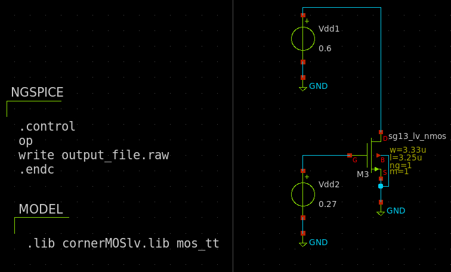

# Module 0 - Foundations

Welcome to the first module in the IHP Open PDK analog design course.
Module Overview

- Setup and Verification of Tools
- Notes on the Design Flow
- Setting Up gm/Id Methodology (Optional)
- Verifying gm/Id Design in Xschem (Optional)

## Setup and Verification of Tools

To install and set up the tools for working with the IHP Open PDK, refer to the installation guides in the ReadTheDocs link below:
   ```
    https://ihp-open-pdk-docs.readthedocs.io/en/latest/index.html
   ```
After following the installation steps, you should be able to launch Xschem by entering the following command in your terminal:

    xschem

Upon launching, the initial Xschem window should appear as follows:
<p align="center">  </p>

This view includes test cases within the IHP PDK, demonstrating different types of simulations. Below is an overview of each type:

- DC Analysis: Evaluates steady-state operation of devices, such as operating points and device characterization.
- Transient Analysis: Assesses time-domain behavior, showing device operation over time and response to input changes.
- AC Analysis: Examines frequency response, including cutoff frequencies and phase shift.
- Monte Carlo Analysis: Provides statistical data on device performance variability due to random influences, such as manufacturing deviations.
- S-Parameter Analysis: Focuses on high-frequency behavior, describing network reflection and transmission, useful in RF design.

The simulation library allows you to explore different designs and understand the simulation setups, which will be covered in detail throughout the course. To get started, try opening dc_lv_nmos by selecting the instance and pressing e. This will open the schematic view.

From here, navigate to the "netlist" button in the top-right corner, then press "simulate." Your first schematic simulation in Xschem will now be complete. View the results by left-clicking the green arrow while holding down Ctrl. The output should look like this:
<p align="center">  </p>

If the dark mode theme is hard to read, you can toggle it by pressing "Shift + O."

### Opening K-Layout
In order to test if K-layout is working properly, the following line can be executed anywhere

   ```
    klayout -e
   ```
This will launch klayout in edit mode. After this navigate to File -> New Layout. A small box will apear with the following input sections

- Technology
- Top cell
- Database unit
- Initial window size
- Initial layers(s)

Kepp all seetings default except for the technology box, where "sg13g2 - IHP SiGe 130nm technology" should be avaliable and chosen. After this press Ok. From here navigate to the toolmanger and select Instance. When this is done you the left pane should show the selected instance in the SG13 development Pcells library.  If the Sg13 dev library isnt avaliable, you should close the program and ensure that you have included the submodules in the git pull, i.e

```
   git pull --recurse-submodules
```

## Notes on the Design Flow

Analog design requires a solid foundation in analog electronics to ensure high-performance and robust designs. In this course, all circuits have been designed with the gm/Id methodology rather than traditional small-signal calculations using square-law models. This method uses model parameters to generate lookup tables, enabling a more data-driven approach to design. If you're interested in understanding the circuit design procedures in greater detail, each module includes Jupyter Notebook scripts as references for a more advanced IC design approach using open-source tools.

For a deeper dive into the gm/Id methodology, consider watching this video by Mastering Microelectronics: https://www.youtube.com/watch?v=dzz4z3ijVts

Refer to the next section for instructions on setting up the gm/Id tools using pygmid/maddwet gmid lib.
## Setting Up gm/Id Methodology (Optional) (Currently not working)

To set up the gm/Id tools, access the pygmid repository:

Repository URL: https://github.com/dreoilin/pygmid

Switch to the "Ngspice" branch and clone the repository to a destination of your choice. Follow the installation instructions in the README. To generate the lookup table, create a configuration file specifying parameters. Below is a sample configuration file to sweep the low-voltage devices, sg13_lv_nmos and sg13_lv_pmos, with relevant parameters:

```

[MODEL]
file = /path/to/IHP-Open-PDK/ihp-sg13g2/libs.tech/ngspice/models/cornerMOSlv.lib mos_tt
info = 130nm CMOS, IHP Open Source PDK, SPICE
corner = NOM
temp = 300
modeln = sg13_lv_nmos
modelp = sg13_lv_pmos
savefilen = 130n1vrvt
savefilep = 130p1vrvt
paramfile = params.lib

[SWEEP]
VGS = (0, 20e-3, 1.2)
VDS = (0, 25e-3, 1.2)
VSB = (0, 0.2, 1)
LENGTH = [(0.13, 0.987, 10)]
WIDTH = 1
NFING = 1

[SETTINGS]
RAW_INCLUDE = ['pre_osdi ./psp103_nqs.osdi']
SIMULATOR = ngspice
```
To run the sweep, execute the following command:

```
python -m pygmid --mode sweep --config <config.cfg>
```

This command will generate a .pkl file that serves as the lookup table. To test the table, navigate to the scripting folder in this module and open gmid_commonsource.ipynb.

Note: Ensure the paths to sg13g2_nmos_lv and sg13g2_pmos_lv are correctly referenced in your config file, and modify the LUT path in the script to point to the location of your lookup tables.

## Setting Up gm/Id Methodology (Optional)
To set up the gm/Id tools, navigate to the following repository: [gmid](https://github.com/PhillipRambo/gmoveridpy)

The repository was originally made by [medwatt](https://github.com/medwatt), but here a refactor is used adapted to the IHP PDK. To setup this repository, follow the installation procedure in the repository and finally run the 

```
   gmid_launcher.py
```
You will now be able to insert the values you want to use for, your costum sweeps. In the scripting folder, under this module, an example script was created as a jupyter notebook to showcase how to use gm/id interactively with these sweeps. Furthermore there will be some basic functions defined which can be used for different purposes. Among these a function is used to make a small GUI in order to select different parameters.

## Verifying gm/Id Design in Xschem (Optional)

To verify the design created using the lookup tables, start by identifying key parameters to validate, such as a simple DC gain and first order pole (As seen in the jupyter notebook script). This requires creating a frequency analysis simulation to capture both characteristics. Begin by creating a new schematic in some specified folder:

```
touch gmid_test.sch
```

From here you launch this schematic by typing

```
xschem gmid_test.sch
```
In the jupyter notebook script provided in the scripting folder, the design script, going through som different methods for plotting has a small design of a single transistor to verify the model in simulation. To try out the interactive design, fill in the corresponding parameters in the gui to double check, that the extracted values are correct. After this you need to instanciate a single mosfet in xschem. This is done by navigating to the insert symbol botton, with a nandgate as its icon. Or you can press shift+i. Here you want to click the IHP open pdk path, and click on "sg13g2_pr". Here you should select the "sg13_lv_nmos.sym", and press OK. Now you will place it. Select each instance and press Q to change the widht and the length to the parameters found in the gmid script. i.e 

- $L = 3.25 \mu m$
- $W = 3.33 \mu m$

Now you should conncect the bulk of the devices to the sources with a wire, by pressing "w" and dragging the wire to its location. After this navigate to the symbol library, again by pressing and instanciate the following items:

- xschem_library/devices -> search: gnd -> gnd.sym
- xschem_library/devices -> search: vsource -> vsource.sym (duplicate this item)
- xschem_library/devices -> search: code -> code_shown.sym (duplicate this item)

From here you should connect the individual components so you have the same setup as seen in the following image:

<p align="center">  </p>

Next up we want to write the code for our simulation. Chose one of the code_shown blocks and press Q. In here change the name to NGSPICE and set only_toplevel to true. In the value section, insert the following code:

```
name=NGSPICE only_toplevel=true 
value="
.control
op
write output_file.raw 
.endc
"
```
- .control ... .endc: This block defines a sequence of commands to control the simulation.

- op: Runs a DC operating point analysis, which calculates the steady-state (DC) node voltages and currents based on the current sources, voltage sources, and component values.

- write output_file.raw: Saves all the collected data and defined variables (Av and phase) to a file named output_file.raw. This output file can be used for post-simulation analysis or plotting in external tools.

For the second code block we want to include the model for the transistors, which is done by filling the value parameter with the following:

```
name=MODEL only_toplevel=true
format="tcleval( @value )"
value="
.lib cornerMOSlv.lib mos_tt"
```

Here we see that the corner of the models is chosen as typical typical. More about this in the later modules....


As the last step before we can simulate we must set the netlisting to spice netlist. For this navigate to options-> Netlist Format/Symbol mode and choose Spice netlist. Now everything is setup and you can click netlist in the top right corner and afterwards Simulate. When this is done, a window should pop up, with a message: binary raw file "output_file.raw". Now write 
```
show all
```
in the input to display the DC operating points, and here you can verify that the operating points is set as calculated in the gm/id script.
