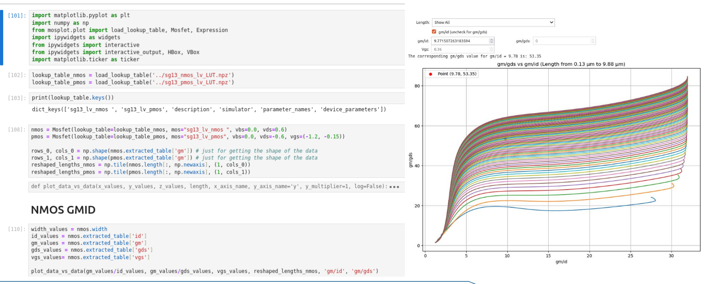

# Module 0 - Foundations

Welcome to the first module in the IHP Open PDK analog design course.
Module Overview

- Setup and Verification of Tools
- Notes on the Design Flow
- Setting Up gm/Id Methodology (Optional)
- Verifying gm/Id Design in Xschem (Optional)

## Setup and Verification of Tools

To install and set up the tools for working with the IHP Open PDK, refer to the installation guides in the ReadTheDocs link below:
   ```
    https://ihp-open-pdk-docs.readthedocs.io/en/latest/index.html
   ```
After following the installation steps, you should be able to launch Xschem by entering the following command in your terminal:

    xschem

Upon launching, the initial Xschem window should appear as follows:
<p align="center">  </p>

This view includes test cases within the IHP PDK, demonstrating different types of simulations. Below is an overview of each type:

- DC Analysis: Evaluates steady-state operation of devices, such as operating points and device characterization.
- Transient Analysis: Assesses time-domain behavior, showing device operation over time and response to input changes.
- AC Analysis: Examines frequency response, including cutoff frequencies and phase shift.
- Monte Carlo Analysis: Provides statistical data on device performance variability due to random influences, such as manufacturing deviations.
- S-Parameter Analysis: Focuses on high-frequency behavior, describing network reflection and transmission, useful in RF design.

The simulation library allows you to explore different designs and understand the simulation setups, which will be covered in detail throughout the course. To get started, try opening dc_lv_nmos by selecting the instance and pressing e. This will open the schematic view.

From here, navigate to the "netlist" button in the top-right corner, then press "simulate." Your first schematic simulation in Xschem will now be complete. View the results by left-clicking the green arrow while holding down Ctrl. The output should look like this:
<p align="center">  </p>

If the dark mode theme is hard to read, you can toggle it by pressing "Shift + O."

### Opening K-Layout
In order to test if K-layout is working properly, the following line can be executed anywhere

   ```
    klayout -e
   ```
This will launch klayout in edit mode. After this navigate to File -> New Layout. A small box will apear with the following input sections

- Technology
- Top cell
- Database unit
- Initial window size
- Initial layers(s)

Kepp all seetings default except for the technology box, where "sg13g2 - IHP SiGe 130nm technology" should be avaliable and chosen. After this press Ok. From here navigate to the toolmanger and select Instance. When this is done you the left pane should show the selected instance in the SG13 development Pcells library.  If the Sg13 dev library isnt avaliable, you should close the program and ensure that you have included the submodules in the git pull, i.e

```
   git pull --recurse-submodules
```

## Notes on the Design Flow

Analog design requires a solid foundation in analog electronics to ensure high-performance and robust designs. In this course, all circuits have been designed with the gm/Id methodology rather than traditional small-signal calculations using square-law models. This method uses model parameters to generate lookup tables, enabling a more data-driven approach to design. If you're interested in understanding the circuit design procedures in greater detail, each module includes Jupyter Notebook scripts as references for a more advanced IC design approach using open-source tools.

For a deeper dive into the gm/Id methodology, consider watching this video by Mastering Microelectronics: https://www.youtube.com/watch?v=dzz4z3ijVts

Refer to the next section for instructions on setting up the gm/Id tools.

### Lookup Table Generation

To generate the lookup tables (LUTs) used in this chapter, we utilized resources from the GitHub repository by [medwatt](https://github.com/medwatt). Specifically, the LUT generation was based on his excellent [`gmid`](https://github.com/medwatt/gmid) project, which provides detailed documentation and well-structured scripts for generating lookup tables. Many thanks to medwatt for making this resource available — if you're working on similar tasks, I highly recommend taking a look at the repository!

The scripts that was made for generating the LUTs can be found as:

- `sg13_nmos_lv.py`
- `sg13_pmos_lv.py`

> **🔧 REMARK:**  
> Make sure to update the path to match your naming convention under `lib_mappings` in **both** files.

## 📘 Usage Overview

### 🔧 Setup Procedure

1. **Clone the Metwatts GMID repository**  
   Follow the installation instructions provided in the repo.  
   > 💡 It is recommended to use a virtual environment.

2. **Generate Lookup Tables**  
   Run the following Python script to generate lookup tables:  
   ```bash
   python sg13_nmos_lv.py
   ```

3. **Install Additional Requirements**  
   Navigate to `module_0_foundations/scripting` and install dependencies:  
   ```bash
   pip install -r requirements.txt
   ```

4. **Launch the GMID GUI**  
   From the same directory, launch the Jupyter notebook:  
   ```bash
   jupyter lab _gmid_test.ipynb
   ```
   This notebook will open a GUI for exploring the GMID lookup tables, which should look like the following:


<p align="center">  </p>


