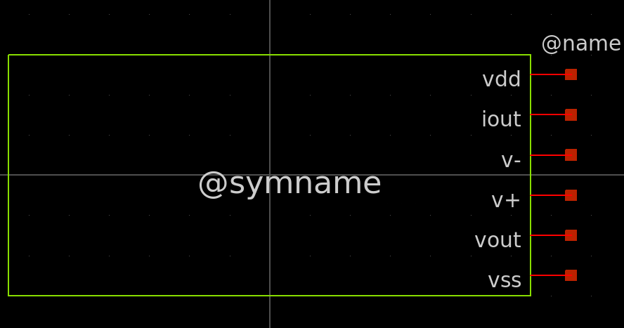
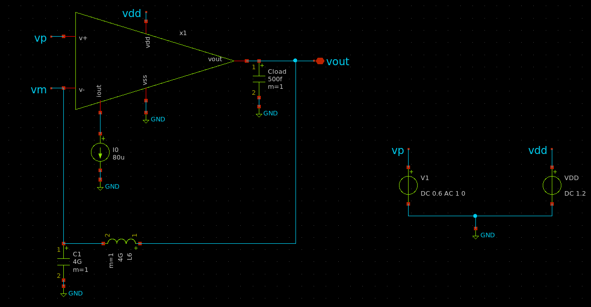
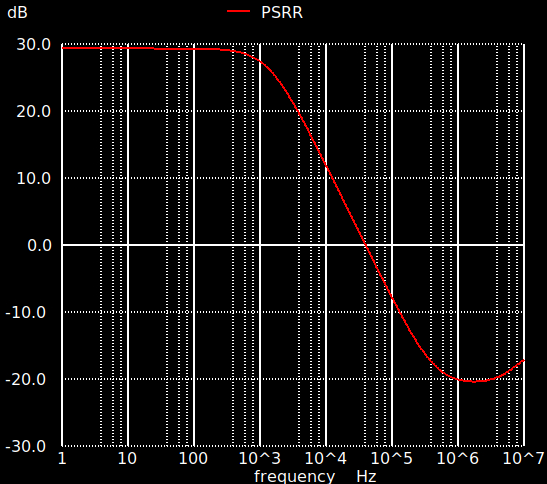

# Two-Stage OTA Implementation in Xschem

The first step in the procedure is to create the schematic for the two-stage OTA used in the design. Begin by creating an Xschem file with the following command:

```
	touch two_stage_OTA.sch
```

Step 2: Instantiating Transistors

Next, instantiate six MOSFETs (three PMOS and two NMOS) using the IHP Open PDK. Refer to the foundation markdown file from Module 0 for guidance on adding these components. Arrange the transistors as illustrated below, configuring their parameters accordingly:
<p align="center">  </p>

To locate the required labels, open the Components Manager and search for iopin.sym under xschem_library/devices.


# Two Stage OTA implimentation in Xschem

First step in our procedure is to create the schematic for the OTA we will use in our design. To do this create a xschem file by typing

```
	touch two_stage_OTA.sch
```

### Step 2: Instantiating Transistors

Next, instantiate six MOSFETs (three PMOS and two NMOS) from the IHP Open PDK. Refer to the foundations markdown file from Module 0 for guidance on adding these components. Arrange the transistors as shown in the image below and configure their parameters accordingly.

<p align="center">
  
</p>

To locate the necessary labels, open the Components Manager and search for `iopin.sym` under `xschem_library/devices`.
### Transistor Dimensions for the First Stage

For clarity, here are the transistor dimensions for the initial stage:
- **M12**: $W = 7.41 \mu m,   \ L = 3.64 \mu$ 
- **M34**: $W = 0.72 \mu m,   \ L = 9.75 \mu m$ 
- **M5**: $W = 5.3 \mu m,   \ L = 1.95 \mu m$ 
- **M9**: $W = 75 \mu m,   \ L = 2.08 \mu m , ng = 8$ 

**Note:** Multi-fingered transistors are used to achieve higher transistor width than the maximal single finger width of $W_{max} = 10\mu m$. For example for transistor M9 an ng of 8 is used in order to achieve a total width of $75\mu m$ giving a single width of $75\mu m/8 = 9.375\mu m$. 


### Step 3: Designing the Output Stage

Proceed to draw the output stage, which includes a Miller compensation capacitor. Follow the configuration shown below:

<p align="center">  </p>


Dimensions for the output stage components are as follows:
- **M6** : $W = 28.8 \mu m,   \ L = 9.75 \mu m, \ \  ng=4$ 
- **M79**: The same as M9 
- **C1**: $W = 22.295\mu m,   \ 22.295\mu m$

For the Miller capacitor, use a metal-insulator-metal (MIM) capacitor with the given dimensions and multiplier to achieve an approximate capacitance of $C_C\approx 750 fF$. Ensure that each transistor’s bulk is connected correctly.

### Creating a Symbol for the OTA

With the schematic for the two-stage OTA complete, the next step is to create a symbol that represents the OTA as a single component. This symbol will simplify using the OTA in higher-level designs.

### Step 1: Open the Schematic in Symbol Creation Mode

Open the completed schematic (`two_stage_OTA.sch`) in Xschem and enter symbol creation mode by selecting **Symbol > Make symbol from schematic** (shortcut: **a**). This will allow you to create a graphical representation of the OTA, complete with input, output, and power pins. Close the schematic view, then open the newly created symbol file, which will have a `.sym` extension.
### Step 2: Define Pin Locations

Identify the key pins for the OTA, which will include:

- **v+** and **v-**: Differential input pins
- **vout**: Output pin
- **vdd**: Positive power supply
- **vss**: Ground/lowest potential
- **iout**: Bias current
Its also possible to remove the bias current pin and replace with an actual on chip bias! 

### Step 3: Adding and Placing Pins on the Symbol

In symbol mode, Xschem automatically creates a small rectangle that includes pins with default names based on your schematic. Give the symbol an appropriate name and you should see the following

<p align="center">  </p>


### Step 4: Designing the Symbol Shape

Now, using the **Draw** tools in Xschem, modify the default rectangle to create a more fitting shape for the OTA. For a simple yet effective design, you can adjust the symbol by pulling in the existing edges to form a triangle, which is a common and recognizable shape for operational amplifiers. This shape helps to distinguish the input, output, and power connections clearly.

If you’re interested in learning to create more complex shapes, there are resources on YouTube and other platforms. However, if you already have experience drawing schematic symbols, this step should feel straightforward. Refer to the provided images as a guide for arranging the shape and positioning the pins for a clean, organized symbol.


<p align="center">  </p>


(Note: If the grid size and snapping values are too big, you can adjust at view - -> Set snap value/set grid spacing )

### Step 5: Finalizing Pin Labels and Saving the Symbol

Once the symbol shape and labels are in place, save your custom symbol by going to **File > Save Symbol As**. Choose a descriptive name, such as `two_stage_OTA.sym`, to clearly identify it for later use. This saved symbol can now be used in higher-level schematics to represent the OTA circuit in a compact, easily recognizable form.

### Creating a Testbench Schematic for Frequency Response Analysis

### Step 1: Create the Testbench Schematic

Create a new schematic for the testbench where you will conduct the frequency response analysis of the OTA. This schematic will be used to assemble the necessary components and connections for the simulation.

Use the following command to create a new schematic file:

```
	touch ota_testbench.sch
```

### Step 2: Insert the OTA Symbol

In your newly created testbench schematic, insert the **two_stage_OTA.sym** symbol that you created earlier. This symbol represents the OTA that you will analyze.

To insert the symbol:

1. Open the **Components Manager** by clicking  **Insert Symbol** .
2. Navigate to `current dir` >  `two_stage_OTA.sym` (if the symbol is in your current directory!).
3. Place the symbol on the schematic.

You should now have the OTA symbol in the center of your schematic, ready to be connected to the voltage sources and feedback network.

### Step 3: Setting Up the Open-Loop Testbench

To set up the first testbench for simulating the open-loop frequency response of the OTA:

1. **Add Voltage Sources**:
    
    - Insert two voltage sources: one for the positive input (with frequency magnitude) and one for VDD.
    - These voltage sources will apply both the DC bias (common mode) and the AC signal to the OTA input.
2. **Ground VSS**:
    
    - Ensure that VSS is grounded, as the circuit operates within a voltage range of 0-1.2V.
3. **Locate the Sources**:
    
    - You can find the required ideal voltage sources in the Xschem library.
4. **Add Current Sources and Load Capacitor**:
    
    - Import a current source (`isource.sym`) and a load capacitor (`capa.sym`) from the library.
    - Set the following values:
        - Output current source ($I_{out}$): $80 \mu A$ (its set large so we can apply current source externally in real life!)
        - Load capacitor ($C_{load}$): $500 fF$.
5. **Verify the Setup**:
    
    - At this point, your schematic should resemble the provided image, ensuring all components are placed and connected correctly.
    <p align="center">  </p>
As you may see there is additional components in the picture. The reasoning behind this can be seen in the following sections
#### **Series Feedback with Infinite Inductor**

1. Place an **infinite inductor** (or a very large inductance value, such as 1H) between the **OTA output** and the **negative input** (**In-**).
2. This creates the series feedback path necessary for simulating the open-loop configuration.

#### **Parallel Feedback with Infinite Capacitor**

1. Add an **infinite capacitor** (or a very large capacitance, such as 1F) in parallel with the inductor.
2. This parallel path complements the series feedback, contributing to shaping the OTA's frequency response.

This feedback network establishes the conditions for analyzing the OTA's open-loop gain while ensuring proper DC biasing in the circuit. 

### Step 4: Include Transistor Models and Configure Simulation Settings

To ensure the simulation runs correctly, you must specify the correct transistor models and process corner. This includes models for the **MIM capacitor** and **LV MOSFETs**. Follow these steps to configure the models using a code block component in Xschem:

---

#### **1. Add a Code Block Component**

- Locate the **code block** (`code_shown.sym`) component in the Xschem library.
- Place the code block in the schematic near the testbench setup for clarity.

---

#### **2. Configure the Code Block**

Set the properties of the code block as follows:

- **Name**: `MODEL`
- **Only Top-Level**: Set to `false`.
	- to include subcircuits
- **Format**: Set to `"tcleval( @value )"`.
    - This tells Xschem to evaluate the code block's value dynamically using Tcl scripting.

---

#### **3. Define the Model Paths**

In the **Value** field, insert the following code:
```
.lib $::SG13G2_MODELS/cornerCAP.lib cap_typ 
.lib cornerMOSlv.lib mos_tt
```

#### **4. Explanation of the Code**

- `.lib $::SG13G2_MODELS/cornerCAP.lib cap_typ`
    
    - **`$::SG13G2_MODELS`**: This variable refers to the path where the SG13G2 process models are stored.
    - **`cornerCAP.lib`**: This file contains the models for the MIM capacitor.
    - **`cap_typ`**: Specifies the typical process corner for capacitors.
- `.lib cornerMOSlv.lib mos_tt`
    
    - **`cornerMOSlv.lib`**: This file contains the low-voltage MOSFET models.
    - **`mos_tt`**: Specifies the **Typical-Typical (TT)** process corner for the MOSFETs

By including this code block, you ensure the simulation has access to the correct models and process corners. At this point, your code block should resemble the provided image.
<p align="center">  </p>

### Extra Information About process corners: Understanding Variations in Semiconductor Fabrication
Process corners are sets of predefined conditions that account for variations in semiconductor manufacturing processes. These variations affect the electrical characteristics of devices (like MOSFETs and capacitors) and can impact circuit performance. Simulating across process corners ensures your design works reliably under real-world manufacturing tolerances.

---

#### **Key Factors in Process Corners**

Process corners arise due to differences in:

1. **Doping Concentration**: Variations in dopant levels during fabrication.
2. **Oxide Thickness**: Minor differences in gate oxide thickness.
3. **Lithography and Etching**: Variability in physical dimensions of the devices.
4. **Material Properties**: Changes in mobility and resistance of materials.

---

#### **The Standard Process Corners**

1. **TT (Typical-Typical)**
    
    - Represents the average case, with both NMOS and PMOS devices performing at nominal levels.
    - Used for designing baseline circuit performance.
2. **FF (Fast-Fast)**
    - Represents devices with higher-than-expected speeds due to lower resistance and higher mobility.
    - Useful for analyzing fast operation and timing issues.
3. **SS (Slow-Slow)**
    - Models slower devices due to higher resistance and lower mobility.
    - Ensures the circuit functions under the worst-case performance conditions.
4. **FS (Fast-Slow)** / **SF (Slow-Fast)**
    
    - Models mismatch between NMOS and PMOS speeds.
    - Critical for analyzing differential pair mismatches and complementary logic issues.

---

### Step 5: Setting Up Code for Simulation

To analyze the frequency response and DC operating point of the OTA, we will incorporate a simulation code block written in **Ngspice**. This code block will handle the operating point (DC) analysis and AC frequency response analysis.

#### **Importing the Ngspice Code Block**

1. Import a **Code Block Shown** from the Xschem library, as previously described.
2. Rename the block to **NGSPICE** for clarity.
3. Ensure that the **netlisting** mode is set to **Spice netlist**:
    - Go to **Options → Netlist format/Symbol mode**.
    - Select **Spice netlist** from the dropdown.

This step is crucial because the netlist format defines how Xschem interprets the schematic for Ngspice.

#### **Setting Up the Operating Point Analysis**

The first part of the Ngspice code block defines the **Operating Point (OP) Analysis**. This calculates the DC biasing conditions for the circuit and saves the results in a file named `tb_OTA_op.raw`. These results allow us to verify transistor parameters and explore deeper hierarchy levels (e.g., symbol-to-schematic mapping).

Insert the following code into the **NGSPICE** block:

```
name=NGSPICE only_toplevel=false 
value="
.control
op
save all
write tb_OTA_op.raw
.endc
```
- **`op`**: Performs the DC operating point analysis.
- **`save all`**: Saves all simulation data, including node voltages and branch currents.
- **`write tb_OTA_op.raw`**: Outputs the operating point results to a raw file

#### **Defining the AC Frequency Response Analysis**

The second part of the code block sets up the **AC Analysis**, which computes the open-loop gain and phase response of the OTA. The AC simulation sweeps frequencies logarithmically (decades) from $1Hz$, $10MHz$ with 100 points per decade.

Append the following code to the **NGSPICE** block:

```
.control
op
ac dec 100 1 10e6 
save all
let Av = db(v(vout))
let phase = 180*cph(vout)/pi
write output_file.raw 
.endc
```
- **`ac dec 100 1 10e6`**: Defines an AC sweep with:
    - **`dec`**: Logarithmic frequency scaling.
    - **`100`**: 100 points per decade.
    - **`1` and `10e6`**: Frequency range from 1 Hz1 \, \text{Hz}1Hz to 10 MHz10 \, \text{MHz}10MHz.
- **`let Av = db(v(vout))`**: Computes the open-loop gain $A_V$​ in decibels.
- **`let phase = 180*cph(vout)/pi`**: Converts the phase of the output voltage from radians to degrees.
- **`write output_file.raw`**: Saves the AC analysis results to a raw file for further processing.
#### **Verifying the Code Block**
The complete code block should look as shown in the image below:
<p align="center">  </p>


### Step 6: Running simulation and confirming operation

Now that all components are in place, you can run the simulation. This will allow you to analyze the **open-loop** of the OTA. For this navigate to netlist in the upper right corner to generate the netlist and after this press simulate. At this point a terminal should pop up showing something like this

```
Doing analysis at TEMP = 27.000000 and TNOM = 27.000000

Using SPARSE 1.3 as Direct Linear Solver
Note: Starting dynamic gmin stepping
Note: Dynamic gmin stepping completed

No. of Data Rows : 1
binary raw file "tb_OTA_op.raw"
Doing analysis at TEMP = 27.000000 and TNOM = 27.000000

Using SPARSE 1.3 as Direct Linear Solver
Note: Starting dynamic gmin stepping
Note: Dynamic gmin stepping completed

No. of Data Rows : 1
Doing analysis at TEMP = 27.000000 and TNOM = 27.000000

Using SPARSE 1.3 as Direct Linear Solver
Note: Starting dynamic gmin stepping
Note: Dynamic gmin stepping completed
 Reference value :  1.00000e+00
No. of Data Rows : 701
binary raw file "output_file.raw"
```
At this point you can write plot Av or write plot phase to see the magnitude or the phase response of the amplifier. To better analyse the results in terms of gain and stability. We will create two plots where we can print the plots in. For this navigate to simulation tab -> graphs and select add vaeform graph. Create two of these. Place them in the testbench above eachother. From the same place also add waveform reload launcher. From here click the waveform reload launcher and specify you raw file, as follows:

```
name=h5
descr="load waves" 
tclcommand="xschem raw_read $netlist_dir/output_file.raw ac"
```
After this press ctrl and left click the arrow, and after this double click the bottom plot. From here you should see all the avaliable signals for plotting and select the ph(vout). This gives the phase response. This is used instead of the statement we defined since xschem automatically saves the data in the raw format as a complex number with a real and imaginary number. From check the Log X box and set the x max to 6.65 and the y min to -200 and Y max to 0. For the second plot double press this and now select the Av to be plotted. From here also check the log x box, set the x axis to the same as for the phase plot and the Y max to 77. From here you should see the same as in the following picture

<p align="center">  </p>

Refer to the provided images and simulations to confirm the setup and ensure everything is correctly configured for the analysis.

### Step 9: Insert a Second OTA Symbol for CMRR Analysis

After confirming the open-loop, you will introduce a second **OTA symbol** to test the common mode rejection ratio

1. Insert another **two_stage_OTA.sym** symbol into the schematic.
2. Connect the two inputs together

By now you should have the following setup
<p align="center">  </p>

Now the code block should also have an extended definition where we will define our CMRR calculation as 

```
	let CMRR = db((v(vout)/v(vp))/(v(vout1)/v(vp)))

```
Now you can add another graph window, or just use the XTerm terminal. You should now see a CMRR in the same region as the following image
<p align="center">  </p>


### Step 9: Insert a Third OTA Symbol for PSRR Analysis

For the power supply rejection ratio we don't expect to good results since we are using a topology where the impedance from the supply to the output really isn't that high. If you want to improve this you can change topology or implementing telescopic approach with cascode mirrors. The power supply rejection ratio is given as 

$$PSRR = 20 \cdot log\left(\frac{\Delta V_{out}}{\Delta V_{V_{DD(AC)}}}\right) $$


For the simulation setup, we refer to the description below

1. Insert another **two_stage_OTA.sym** symbol into the schematic.
2. Use the same structure as for the open loop gain but set the positive input only to common mode DC and no AC signal!
3. For the supply now add a AC signal of 1 and a phase of 0

For the setup it should something like this
<p align="center">  </p>


For the code block you can define the PSRR as given 

```
let PSRR = db(v(vout2)/v(VDDac))

```
For the power supply rejection ratio you should see something like this:
<p align="center">  </p>


