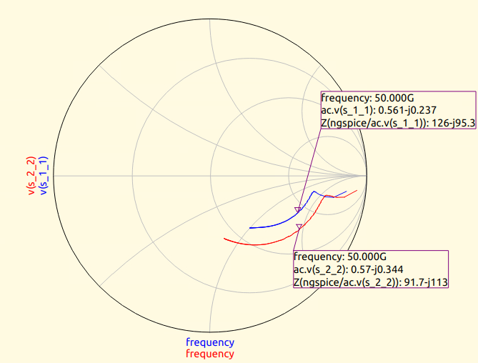
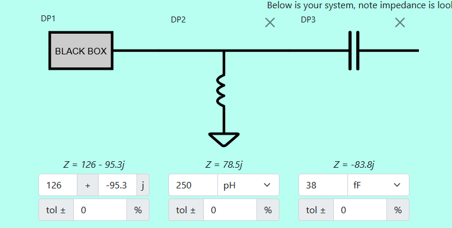
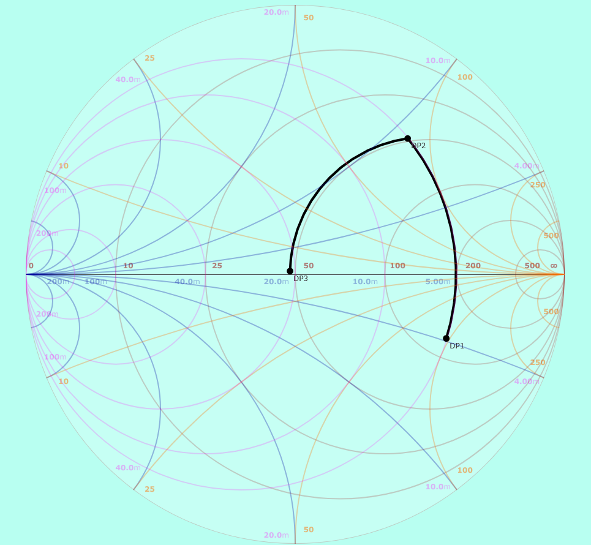
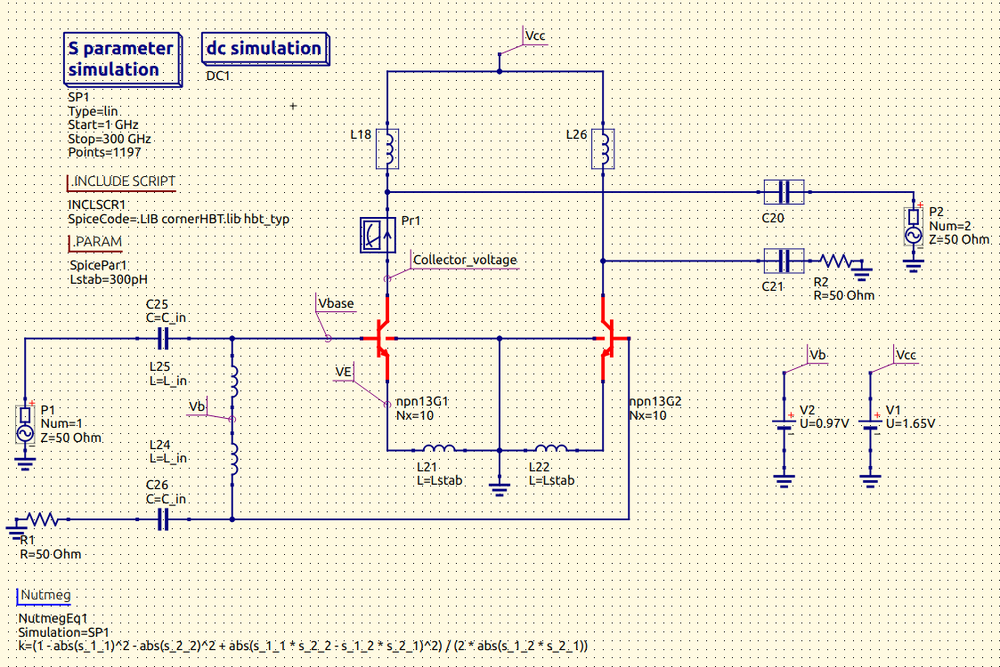

# Input and Output Matching for the MPA

In this section, we will focus on matching the input and output of the MPA (Monolithic Power Amplifier) for a 50-ohm termination. For now, we will use ideal components to estimate starting values, which will later be refined through electromagnetic (EM) simulations. The goal at this stage is to explore the possible design space, not to finalize the design.

#### Step 1: Input Reflection Coefficient (S11)

The first task is to analyze the input reflection coefficient (S11) to ensure proper impedance matching. Starting from the schematic we developed in the biasing stage, we will run the simulation to observe the behavior of S11.

To visualize this, we begin by inspecting the Smith chart at 50 GHz, where we observe the initial impedance characteristics. The Smith chart provides a clear picture of how well the input is matched to the 50-ohm termination.

  

From this point, you can use a Smith chart tool of your choice to facilitate the matching process. In this case, we will perform an L-section matching, using a capacitor as the series element. For this, we utilized the following online Smith chart tool: [Will Kelsey’s Smith Chart Tool](https://www.will-kelsey.com/smith_chart/)

#### Step 2: L-Section Matching

After using the Smith chart tool, we determined that an inductor of 250 pH and a capacitor of approximately 38 fF provide a good starting point for matching the input. These values were chosen based on the Smith chart's behavior at the given frequency.

  

  

With the estimated component values in hand, we return to the schematic and insert the components accordingly. This results in the updated schematic, where the inductor and capacitor are now part of the matching network.

  

#### Step 3: Fine-Tuning the Parameters

Once the components are added to the schematic, we can use the Smith chart again to visualize the S11 reflection coefficient. Fine-tuning the values of the input inductor (Lin) and capacitor (Cin) is an iterative process, and after optimization, the following values were obtained:

- **Lin** = 254.5 pH
- **Cin** = 36.974 fF

These values help to achieve a better match, improving the impedance at the input.

#### Step 4: Output Reflection Coefficient (S22) Matching

The same procedure is applied to the output matching. We aim to match the output impedance (S22) to the 50-ohm termination. The steps for this process are identical to those for the input matching. After optimization, the final component values for the output network were determined to be:

- **Lout** = 273 pH
- **Cout** = 88 fF

The reflection coefficients for both input and output can now be visualized, showing the improved impedance matching.

#### Final Reflection Coefficients

After completing the matching process, the final S11 and S22 reflection coefficients can be seen in the following images, which indicate good impedance matching around the target frequency.

  

  

