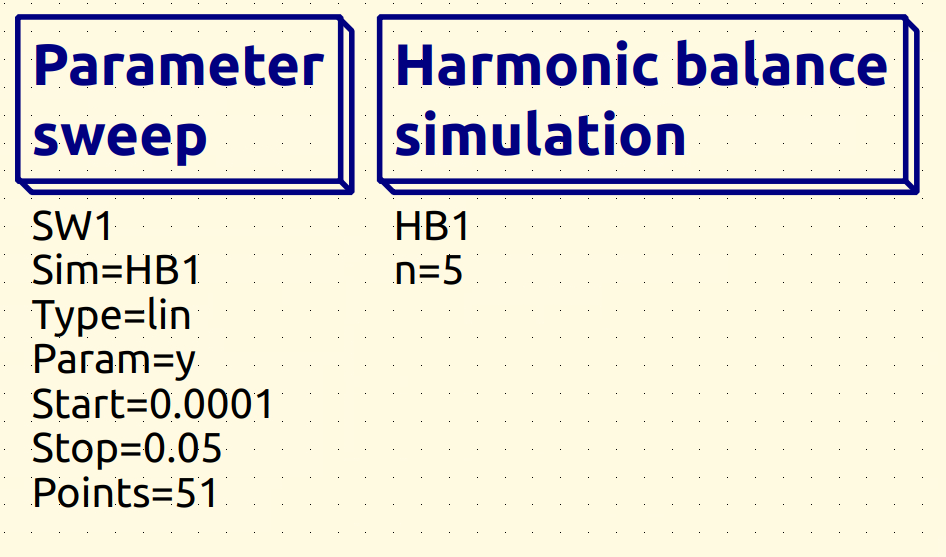
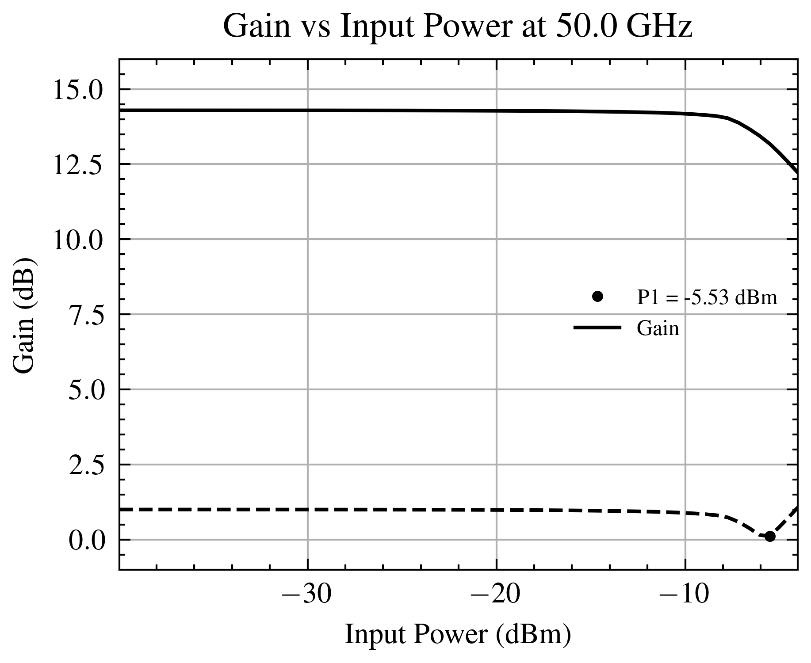

# Non-Linear Simulation

At this stage, we extend our simulations into the non-linear domain, as linearity is a critical factor in power amplifier design. To assess this, we need to determine the **P1dB compression point**, which indicates when the amplifier starts deviating from linear operation. Additionally, we will perform a **load-pull analysis** to optimize the output match for high linearity.

For non-linear simulations, **Ngspice** is no longer sufficient, as it does not support **harmonic balance analysis**, which is essential for capturing the non-linear behavior of RF circuits. Instead, we use **Xyce**, which provides the necessary non-linear simulation capabilities. However, Xyce lacks robust internal match calculations and graphing tools, making post-processing necessary. To overcome this, all data analysis and visualization will be handled through **Python scripts**, which process simulation results on the fly. The required scripts are available in the repository and should work seamlessly if schematic labels and naming conventions are followed consistently.

Since non-linear simulations often require **input power sweeps**, but Xyce does not directly support this functionality, we will implement a workaround using a **sinusoidal current source** in combination with a fixed load resistance to vary the power level

### Setting Up the First Testbench

For the first testbench, we continue from the previous schematic and modify it for non-linear simulation. Since we are now using Xyce models, we must specify a different library file for the HBT transistors. The correct path to the model library is:

```
/../../IHP-Open-PDK/ihp-sg13g2/libs.tech/xyce/models/cornerHBT.lib
```

Additionally, we need to instantiate two key components:

1. **Harmonic Balance Analysis Block** – Required for frequency-domain simulation of non-linear behavior.
2. **Parameter Sweep Block** – Used to step through different operating conditions, such as varying input power.

The setup for these components is illustrated in the image below:

<p align="center">  </p> 

### Configuring the Parameter Sweep and Harmonic Balance

_(Note: The Harmonic Balance block is only visible when the Xyce simulator is enabled.)_

As shown in the image above, the **parameter sweep** is configured as follows:

```
SW1
sim=HB1
Type=lin
Param=y
Start=0.0001
Stop=0.05
Points=51
```
_(make sure that the step size is a n natural number)_
This setup defines a **linear sweep** for the parameter **y**, ranging from **0.0001 to 0.05** with **200 points**. This will allow us to analyze how the amplifier responds over a range of input conditions.

For the **Harmonic Balance** analysis, the key parameter **n** is set to:

$$n=5n$$


The complete schematic setup for the non-linear analysis, including all relevant components, is shown in the image below:

<p align="center">  </p> 

_(Remember to set the frequency of sources and components accordingly.)_

In this setup, we define a **parameter** named **y** with a default value. This parameter is essential for performing the input power sweep, but the value of y specified in the param section is unimportant in this case.

As seen in the sweep configuration, we vary the **input current** from **0.0001 A to 0.05 A** through a **constant 50Ω resistor**. This corresponds to an **input power range of -33 dBm to 21 dBm**.

This sweep is crucial for evaluating the amplifier's behavior in the **non-linear region**, allowing us to determine its **1 dB compression point (P1dB)**—a key metric for assessing linearity.


### Running the Simulation and Verifying Results

At this stage, we can proceed with running the simulation. Once the simulation is complete, the first step is to **instantiate a table** to inspect the results and ensure that the output data is correctly formatted.

In the table, we should observe **10 data points** for each swept parameter, corresponding to the **harmonic components**, both **positive and negative**. This confirms that the simulation is correctly capturing the harmonic balance response.

The expected table output is shown below:

<p align="center">  </p> 

### Processing the Simulation Data

As seen in the results table, the simulation has run successfully. This confirms that the **sweeping parameter**, **frequency axis**, and **raw data** are correctly recorded.

Within the **part_3_non_linear_analysis** section, a folder named **python** contains a script designed to facilitate post-processing. This script aims to provide an easy way to **plot gain vs. input power** and **output power vs. input power**.

**Note:** There may be potential issues with the script, so adjustments might be required depending on the data format or specific cases encountered.

To use the script, navigate to its location and run the following command:

```
python3 plot_xyce.py
```

this will print the following information, to show functionality:
```
This script processes and extracts variables from a specified dataset file.
You can use the script in the following ways:
1. To list all independent and dependent variables in the dataset:
   python3 script.py <file_path>
2. To print all values for a specific variable:
   python3 script.py <file_path> <variable_name>
3. To run the analysis and generate plots, pass the following arguments:
   python3 script.py <file_path> <vout_var> <vin_var> <iin_var> <iout_var> <sweep_var> <freq_interest> [xlim_min xlim_max]

```
From here, navigate to the simulation directory containing the dataset file and execute the following command:

```
python3 ../../python/plot_xyce.py load_pull.dat.xyce "V(VOUT)" "V(VIN)" "I(PR2)" "I(PR3)" "Y" 50e9 -30 -10 -1 16
```
This command generates a readable plot of **gain vs. input power**. For **output power vs. input power**, adjust the boundaries accordingly.

If the naming conventions of the variables differ in your schematic, use the following command to list all available parameters in the dataset:
```
python3 ../../python/plot_xyce.py load_pull.dat.xyce
```
Once the script runs successfully, the **gain vs. input power** plot should resemble the following:
<p align="center">  </p> 

<p align="center">  </p> 


## Performing Load Pull

As observed in the previous simulation using ideal output components, the **1 dB compression point** was approximately **-7.88 dBm**. To optimize the output network, we aim to maximize the circuit's **linearity**. However, since sweeping a **complex impedance** (i.e., a±bia \pm bia±bi) is not straightforward, we instead perform a **resistive sweep** at the output and determine which resistance yields the best linearity.

While this approach requires some manual adjustments, the **Python script** can assist in processing the results. The exact method is left to the user’s preference. In the following example, we analyze the compression point around a **50Ω termination** and identify the most suitable resistance.

It is important to avoid **excessively low resistance values**, as this would degrade the amplifier’s characteristics significantly. Below, the schematic illustrates the setup for a **40Ω termination**:
<p align="center">  </p> 


Gain curve and compression point was seen as the following:
<p align="center">  </p> 


### Evaluating the Compression Point Shift

As observed, adjusting the termination has **moved the compression point upward**.

#### **Implications for the Termination Network**

This result suggests that **matching to a 40Ω termination improves the circuit’s linearity**. However, modifying the output match inevitably **affects the input match** and alters the **reflection coefficients**. This presents a trade-off, and it is left to the reader to determine an optimal matching network.

#### **Recommended Approach**

- Do a matching assuming no influence on input reflection.
- **Gradually tune** the network components to achieve the highest possible **P1dB** while maintaining a good match.

The schematic below illustrates the circuit configuration that will be used in further analysis. The corresponding **gain response** is shown in the final image.
<p align="center">  </p> 

![[harm_balance_5.png]]
<p align="center">  </p> 

![[gain_vs_input_power_3.png]]
