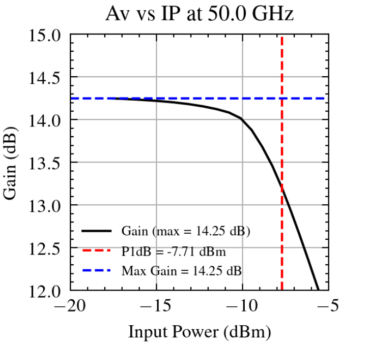

# Non-Linear Simulation

In this section, we extend our simulations into the **non-linear domain**—an essential step in power amplifier design. Non-linearity plays a critical role in determining the performance of amplifiers under high signal conditions. Specifically, we aim to determine the **P1dB compression point**, which indicates when the amplifier begins to exhibit non-linear behavior. Additionally, we will perform a **load-pull analysis** to optimize the output matching for high linearity.

## Transition to Non-Linear Simulations

For linear simulations, **Ngspice** is typically sufficient. However, for non-linear simulations—necessary for RF circuit design—**Ngspice** does not support **harmonic balance analysis**, which is required to accurately capture the non-linear behavior of RF circuits. To address this, we will use **Xyce**, which provides the necessary non-linear simulation capabilities.

While Xyce handles non-linear simulations, it lacks internal calculations and graphing tools. As a result, post-processing is required for analysis and visualization. All post-processing tasks will be handled through **Python scripts**, which are available in this repository and are designed to work seamlessly, provided that the schematic labels and naming conventions are followed consistently.

In this context, we also need to implement a workaround for **input power sweeps**. Xyce does not directly support this functionality, so we will use a **sinusoidal current source** in combination with a fixed load resistance to vary the power level. The current issue is that the power source input power parameter cannot be swept directly. One workaround would be to run Xyce from the terminal and script the sweep externally. However, this approach has not been adopted here, as we aim to maximize interaction with Qucs-S.

---

## Setting Up the First Testbench

We begin by modifying the previous schematic to accommodate non-linear simulation. Since we are now using **Xyce models**, we need to specify a different library file for the **HBT transistors**. The correct path to the model library is:


```
/insert/your/path/IHP-Open-PDK/ihp-sg13g2/libs.tech/xyce/models/cornerHBT.lib
```

We also need to instantiate two key components for the non-linear simulation:

1. **Harmonic Balance Analysis Block** – This block is essential for frequency-domain simulation of the non-linear behavior.
2. **Parameter Sweep Block** – This block is used to step through different operating conditions, such as varying input power.

The setup for these components is shown below:

<p align="center"> 
   
</p>

---

## Configuring the Parameter Sweep and Harmonic Balance

_(Note: The Harmonic Balance block is visible only when the Xyce simulator is enabled.)_

As shown in the schematic above, the **parameter sweep** is configured as follows:

```
SW1
sim=HB1
Type=lin
Param=y
Start=0.0001
Stop=0.05
Points=51
```
_(Ensure that the step size is a natural number)_

This setup defines a **linear sweep** for the parameter **y**, ranging from **0.0001 to 0.05**, with **51 points**. This sweep will allow us to analyze how the amplifier responds to different input conditions.

For the **Harmonic Balance** analysis, we set the key parameter **n** to:

$$n=5$$

Below is the complete schematic setup for the non-linear analysis, including all relevant components:

<p align="center"> 
   
</p>

_(Remember to adjust the frequency of sources and components accordingly.)_

In this setup, we define a **parameter** named **y** with a default value. This parameter is crucial for performing the input power sweep, but the value of **y** specified in the **param** section is unimportant for this specific setup.

As seen in the sweep configuration, we vary the **input current** from **0.0001 A to 0.05 A** through a **constant 50Ω resistor**. This corresponds to an **input power range of -33 dBm to 21 dBm**.

This sweep is essential for evaluating the amplifier’s behavior in the **non-linear region**, enabling us to determine its **1 dB compression point (P1dB)**, a key metric for assessing linearity.

---

## Running the Simulation and Verifying Results

After setting up the simulation, we can run it and check the results. Upon completion, the first task is to **instantiate a table** to inspect the output data and ensure proper formatting.

In the table, we should observe **10 data points** for each swept parameter, corresponding to the **harmonic components** (both **positive and negative**). This confirms that the simulation has correctly captured the harmonic balance response.

The expected table output is shown below:

<p align="center"> 
   
</p>

---

## Processing the Simulation Data

After running the simulation, we can confirm that the sweeping parameter, frequency axis, and raw data are correctly recorded. 

Within the **part_3_non_linear_analysis** folder, a **python** folder contains a **Jupyter Lab script** designed to facilitate post-processing. This script simplifies tasks like plotting **gain vs. input power** and **output power vs. input power**.

To use the script, you will need to extract the **I/O current** and **voltages** by instantiating a **Cartesian plot** under the diagrams section:

<p align="center"> 
   
</p>

To plot the I/O current and voltages, simply double-click the plot and select the appropriate data:

<p align="center"> 
   
</p>

The extracted data should be in the following format (note the selection of arrows in the style) :

<p align="center"> 
   
</p>

After obtaining the data, navigate to the **Jupyter Lab** script, ensuring that the data is properly pointed to as shown below:

<p align="center"> 
   
</p>
Using the script you will optain plots like seen in the last image in the following markdown file.
**Note:** There may be potential issues with the script, and you might need to adjust it based on the specific data format or cases encountered.

---

## Performing Load Pull

The goal of the load-pull analysis is to optimize the **output network** for maximum **linearity**. Since sweeping a **complex impedance** (i.e., a ±b𝑖) can be challenging, we use a **resistive sweep** at the output to find the best resistance for maximizing linearity. Additionally, it is possible to add a parallel capacitor or inductor to adjust the imaginary part of the impedance at a given resistance.

While this approach requires some manual adjustments, a **Python script** can assist in processing the results. The exact method is up to the user’s preference. Below, we focus on identifying the **compression point** around a **50Ω termination**, but similar steps can be followed for other resistances.

It is important to avoid **excessively low resistance values**, as these will degrade the amplifier’s performance. Below is the schematic showing the setup for a **40Ω termination**:

<p align="center"> 
   
</p>

### Recommended Approach

1. Assume no influence on input reflection during the matching process.
2. **Gradually tune** the network components to achieve the highest possible **P1dB** while maintaining a good match.

The schematic below shows the configuration used for further analysis, and the corresponding **gain response** is depicted in the final image:

<p align="center"> 
   
</p>

<p align="center"> 
   
</p>

