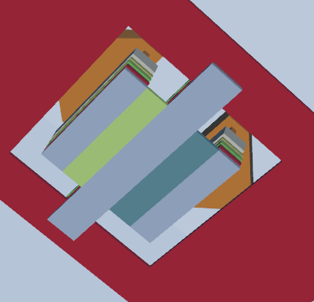
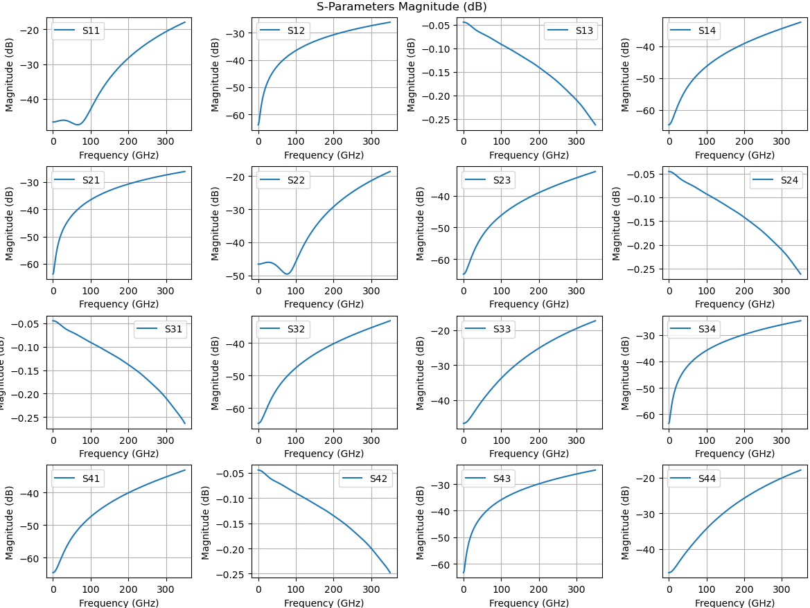
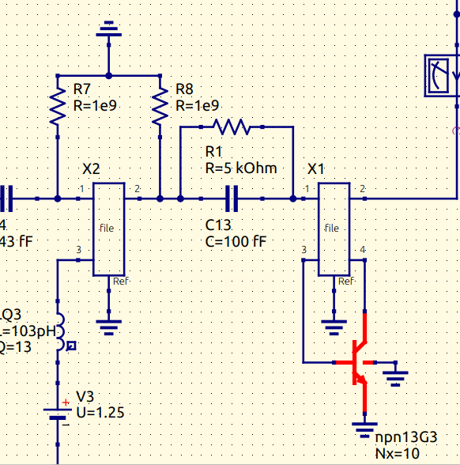

## Electromagnetic Simulation and Layout

### The Importance of EM Simulation in RF Circuitry Design

In radio frequency (RF) design, electromagnetic (EM) simulation is an essential tool for ensuring optimal circuit performance within its intended frequency range. RF circuits—such as amplifiers, filters, oscillators, and antennas—are particularly sensitive to electromagnetic field interactions. As a result, accurately accounting for these effects during the design process is critical to achieving the desired performance.

RF circuits typically operate across a broad frequency spectrum, from a few MHz to several GHz. At these high frequencies, even minor imperfections in the physical layout—such as mismatched impedance, stray capacitances, or excessive inductance—can lead to significant degradation in circuit performance.


While EM simulations provide valuable insights, they also introduce complexity into the design process. In high-frequency RF designs, factors such as layout, trace lengths, component placement, and material properties must be carefully considered. Even small changes in these parameters can cause large deviations in circuit behavior, making EM simulation an indispensable tool for RF designers.

---

## openEMS: An Open-Source EM Simulation Tool

### Overview of openEMS

openEMS is a powerful, open-source tool designed for simulating the behavior of electromagnetic fields in high-frequency systems. Built on the Finite Difference Time Domain (FDTD) method, openEMS provides a flexible and efficient platform for simulating complex electromagnetic structures, making it ideal for RF circuit designers, antenna engineers, and other professionals working in high-frequency domains.

In this guide, we will explore a Python interface developed by [Volker Mühlhaus](https://muehlhaus.com/about), which integrates openEMS with the IHP stack-up. This interface simplifies the process of visualizing your .gds (GDSII) files and extracting relevant data, while also allowing for straightforward parameter setting. We highly recommend checking out the comprehensive documentation available for this interface with openEMS, which can be found here:

[openEMS IHP SG13G2 Documentation](https://github.com/VolkerMuehlhaus/openems_ihp_sg13g2)

## EM Simulation of the MPA Core

### Introduction to MPA Core Simulation

The first step in simulating the circuit is to focus on the core connections of the transistor. This involves modeling the surrounding wiring that connects the core components together. To ensure the wires can handle the significant currents expected in the design, certain design considerations must be made. However, we will not delve deeply into the specifics of layout design in this chapter. The reader is encouraged to account for these aspects when designing their own circuits.

The primary objective of this part is to create a workflow for EM simulation.

---


### Viewing the GDS of the Core
Under the following module you will find the layout of the core used for this MPA, i the following location 

```
core_1/layout_gds

```
The layout can be seen Below:
<p align="center"> 
   
</p>


As shown in the layout, the transistor is placed at the center of the design. For the purpose of our EM simulation, we remove the transistor, leaving only the core structure. This simplified version of the layout is then used for simulating the electromagnetic behavior of the circuit.

<p align="center"> 
   
</p>


The attentive reader may notice small layers at the ends of each of the TopMetal2 lines, as well as at the center of the design. These layers are highlighted with arrows in the image below:
<p align="center"> 
   
</p>

These are the definitions of the ports for the openEMS simulation, which are created by adding a "custom" layer in KLayout. The layer can be seen in the pane, and it follows the syntax shown below:

<p> 
   
</p>


More about this later...

## Folder Structure

The folder located at:

```
`IHP-AnalogAcademy/modules/module_2_50GHz_MPA/part_4_layout_EMsims/core_1/openems`
```
contains the following components:

1. **Modules**: A directory containing all utilities for simulation logic, graphical plotting, and other essential functions.
    
2. **Output**: This folder holds all the data generated during the simulation, including the s-parameter file used for post-EM simulations.
    
3. **SG13G2.xml**: The IHP stackup file in XML format.
    
4. **Simplots**: A folder containing the S-parameter plots defined in the setup script.
    
5. **run_core_50ghz_mpa.py**: The setup script where parameters are passed, and the general simulation setup is defined.
    

In the next section, we'll explore the setup process of the **run_core_50ghz_mpa.py** script.

---

## Setting the Right Parameters

When you open **run_core_50ghz_mpa.py**, the first thing you'll notice is a series of imports. Some of these imports are from the **modules** directory, while others come from external packages that need to be installed. For a detailed list of these requirements, please refer to the documentation provided above.


## Workflow Settings
```
# ======================== workflow settings ================================

# preview model/mesh only?
# postprocess existing data without re-running simulation?
preview_only = True   
postprocess_only = False


```
The script has flags to control the simulation process:

- **`preview_only`**: If `True`, it only generates a preview of the model and mesh without running the actual simulation.
    
- **`postprocess_only`**: If `True`, it skips the simulation and only processes previously generated data.

### Input Files and Path Settings

The code sets the file paths for the input files, such as the GDSII layout file and the XML stackup file. It also sets parameters for preprocessing the GDSII file and whether to merge polygons in the layout.

```
gds_filename = "../layout_gds/50_ghz_mpa_core_no_BJT.gds"  # GDSII layout file
XML_filename = "SG13G2.xml"  # Stackup configuration
preprocess_gds = False  # Whether to preprocess GDSII for cutouts
merge_polygon_size = 0.5  # Size threshold for merging polygons
```
The script calculates the path for the simulation files using utility functions and defines the directory where the simulation output will be stored.

```
script_path = utilities.get_script_path(__file__)  # Get the script's directory path
model_basename = utilities.get_basename(__file__)  # Get the base name of the script
sim_path = utilities.create_sim_path(script_path, model_basename)  # Create a directory for simulation output
```

### Simulation Settings

The script defines simulation parameters such as the unit of measurement (microns), simulation boundaries, frequency range, and mesh cell size.

```
unit = 1e-6  # Geometry is in microns
margin = 100  # Margin from GDSII geometry to simulation boundary in microns
fstart = 0  # Start frequency (Hz)
fstop = 350e9  # Stop frequency (Hz)
numfreq = 401  # Number of frequency points to simulate
refined_cellsize = 0.3  # Mesh cell size in conductor region

```

The boundary conditions for the simulation are also defined here using options like **'PEC'** (Perfect Electric Conductor), **'PMC'** (Perfect Magnetic Conductor), **'MUR'** (simple absorbing boundary), and **'PML_8'** (Perfectly Matched Layer).

```
`Boundaries = ['PML_4', 'PML_4', 'PML_4', 'PML_4', 'PEC', 'PML_4']`
```


### Port Definitions

In openEMS, ports are defined based on GDSII data, and the geometry of the ports is derived from polygons located on specified special layers. The process of defining ports involves specifying the port’s number, voltage, impedance, and the layers that the port spans across. Below is a detailed explanation of how to define ports using the method you provided.

### Port Definition Overview

- **Ports** are defined using the `simulation_setup.all_simulation_ports()` function, which collects all simulation ports.
    
- **Port geometry** is derived from special layers in the GDSII layout, with each port having a specific source and target layer.
    
- The **source layer** represents the starting point of the port, while the **target layer** represents the endpoint. Ports can be either **via ports** (spanning between different metal layers) or **in-plane ports** (on the same layer).
    

### Example Code Explanation

```
# Define all simulation ports
simulation_ports = simulation_setup.all_simulation_ports()

# Add a via port spanning from Metal3 to TopMetal2 in the z-direction (vertical port)
simulation_ports.add_port(
    simulation_setup.simulation_port(
        portnumber=1, 
        voltage=1, 
        port_Z0=50, 
        source_layernum=201, 
        from_layername='Metal3', 
        to_layername='TopMetal2', 
        direction='z'
    )
)

# Add another via port spanning from Metal3 to TopMetal2 in the z-direction
simulation_ports.add_port(
    simulation_setup.simulation_port(
        portnumber=2, 
        voltage=1, 
        port_Z0=50, 
        source_layernum=202, 
        from_layername='Metal3', 
        to_layername='TopMetal2', 
        direction='z'
    )
)

# Add an in-plane port from Metal2 to Metal2 in the -x direction (horizontal port)
simulation_ports.add_port(
    simulation_setup.simulation_port(
        portnumber=3, 
        voltage=1, 
        port_Z0=50, 
        source_layernum=203, 
        target_layername='Metal2', 
        direction='-x'
    )
)

# Add another in-plane port from Metal2 to Metal2 in the x direction (horizontal port)
simulation_ports.add_port(
    simulation_setup.simulation_port(
        portnumber=4, 
        voltage=1, 
        port_Z0=50, 
        source_layernum=204, 
        target_layername='Metal2', 
        direction='x'
    )
)


```
(the code above is the same as in the code in the folder but just written out for more clarity)

### Via Ports

Via ports are defined with the parameters `from_layername` and `to_layername`. These ports span between different layers, representing a vertical connection in the simulation. For example:

```
simulation_ports.add_port(
    simulation_setup.simulation_port(
        portnumber=1, 
        voltage=1, 
        port_Z0=50, 
        source_layernum=201, 
        from_layername='Metal3', 
        to_layername='TopMetal2', 
        direction='z'
    )
)

```
This port spans from **Metal3** (source layer) to **TopMetal2** (target layer) in the **z-direction** (vertical). The port impedance (`port_Z0`) is set to 50 Ohms, and the voltage is set to 1 V.

### In-Plane Ports

In-plane ports are defined with the parameter `target_layername`, indicating that the port lies between two polygons on the same layer. For example:

```
simulation_ports.add_port(
    simulation_setup.simulation_port(
        portnumber=3, 
        voltage=1, 
        port_Z0=50, 
        source_layernum=203, 
        target_layername='Metal2', 
        direction='-x'
    )
)
```

This port is on **Metal2**, and it runs in the **-x direction** (horizontal) across the **Metal2** layer. We will talk about why port 3 has negative polarity comparing to port 4

### Parameters Explained

- **`portnumber`**: A unique identifier for the port in the simulation.
    
- **`voltage`**: The amplitude of the voltage applied to the port (in volts).
    
- **`port_Z0`**: The characteristic impedance of the port (in ohms). This is typically 50 Ohms for standard ports.
    
- **`source_layernum`**: The layer number of the source layer where the port starts.
    
- **`from_layername`** and **`to_layername`**: These parameters define the source and target layers for **via ports**. The port spans between these two layers, typically in the vertical direction (`z`).
    
- **`target_layername`**: Used in **in-plane ports** to specify the target layer where the port ends. The port is within the same layer.
    
- **`direction`**: The orientation of the port. This can be `x`, `y`, `z`, or their negated forms (`-x`, `-y`, `-z`).

### Multiport Simulation

For **multiport simulations**, the ports can be activated or deactivated within the simulation setup, depending on which ports are excited. This is usually handled in a separate section of the code (`simulation_setup.createSimulation()`), where you define which ports are active and their respective excitation properties.

### Importance of Common Ground in Port Placement

In openEMS, ports are always measured between the signal and ground, where the signal represents the active part of the port, such as a transmission line or a signal conductor, and the ground serves as the return path for the current, typically connected to a reference plane. When placing ports in a GDSII layout, it’s essential to position the signal and ground connections appropriately. The ground return must be on the same layer as the signal, or accessible via a via, depending on the port type. This is especially critical in complex designs where signal lines may span multiple layers or areas.

For via ports, which extend from one metal layer to another (e.g., from Metal3 to TopMetal2), it's important to ensure that the ground is present on the bottom layer or the nearest reference layer, such as the GND layer. If Metal3 is used for the signal, the ground for that signal should be located in the bottom metal layer or GND, which will serve as the return path. For in-plane ports, where both the signal and ground are on the same metal layer, the polarity of the ground needs to be set correctly, ensuring that it has the same effective polarity as the signal. Lets look at the example from above:

<p align="center"> 
   
</p>

From this, we can see that **P1** and **P2** are VIA ports connecting Metal3 to **TopMetal2**. In this configuration, Metal3 serves as the ground reference layer, both in practice and for the port abstraction. Therefore, when considering signal propagation and current flow, the signals flow from Metal3 to TopMetal2, in the _Z_ direction.

The situation is different for the **P3** and **P4** connections, which are in-plane ports. In this case, the middle strip above the emitter is connected to the Metal3 reference plane via vias, meaning that the middle strip acts as a reference in the same plane/metal as the ports. When considering signal propagation, if we draw a center line through the strip (as indicated by the yellow line in the middle of the emitter), the signal flows in the _x_ direction for **P4** and in the _-x_ direction for **P3**.
### Running the 3D Viewer

Before starting the EM simulation, we first enable the **preview_only** flag at the top of the script. Then, run the script by executing the following command:

```
python run_core_50ghz_mpa.py 
```

This will launch the 3D viewer, which displays the layout. It serves as an important sanity check to ensure that the code correctly interprets the layout. Pay particular attention to the port placement, as shown below:

<p align="center"> 
   
</p>


Here, we can confirm that the ports are positioned correctly. Specifically, check the following views:
<p align="center"> 
   
</p>


<p align="center"> 
   
</p>

Both the top and bottom views show that our ports are placed properly. Once this is confirmed, we can disable the **preview_only** flag and proceed with the actual simulation of the core.

After running the script again with the flag set to **False**, you should see the following in the terminal:
<p align="center"> 
   
</p>

From here, the simulation will continue until it completes.


### Viewing the Data

Once the simulation is complete, the results will be stored in a folder within the **output** directory. You will find an S-parameter file that corresponds to the number of ports in your system. In this case, it will be a `.s4p` file.

Specific to this repository, there is also a script called **spar_plot.py**, which allows you to visualize the S-parameter data. To generate the plot, run the following command

```
python spar_plot.py your_spar_file.s4p 
```

This will produce a plot of the S-parameters for the core layout in the module, as shown below:
<p align="center"> 
   
</p>

Additionally, the plots will be saved in the **sparam_plots** folder for future reference.


### Performing Simulation with EM-Simulated Components

Now, we will explore how to import the S-parameter file into Qucs-S and use it for the non-linear analysis described in the previous chapter.

#### Step 1: Preparing the Schematic

Start by creating a new schematic based on the improved schematic we worked on previously for the load pull. Once you've done that, I recommend following the structure used in this module for consistency.

#### Step 2: Importing the S-Parameter File

Next, navigate to the **main dock** in Qucs-S and go to **File > Components**. From there, select the **n-port S-parameter file** component and place it in your schematic.

Double-click the S-parameter component to open its properties. In the component properties window, click the **File data** box. From there, press **Browse** and locate the S-parameter file you want to use. Set the number of ports to 4 and leave the other parameters at their default settings. You should now have something similar to the following setup:

<p align="center"> 
   
</p>

#### Step 3: Connecting the S-Parameter Data

Next, you will connect the S-parameter data for the core to your schematic. This will look similar to the following layout:


<p align="center"> 
   
</p>

#### Step 4: Running the Simulation

At this point, you are ready to simulate the behavior of the circuit. Once the simulation is complete, extract the data for the I/O currents and voltages, as described in the previous module. You can plot the data using the methods outlined in the previous steps. The Jupyter Lab files for this can be found in the **art_4_layout_EMsims/data_processing** folder.

For this circuit, the behavior with the core implemented is shown in the following plot:

<p align="center"> 
   
</p>

#### Step 5: DC Bias Issue and T-Connector Layout

In the next part of the module, you will find a layout for a **T-connector**, where you can explore its implementation and simulation. This part presented some challenges because **Xyce** had difficulty defining the DC operating points. As seen in the schematic, the solution was to place extremely large resistors on ports 1 and 2 to set proper biasing for the simulator:
<p align="center"> 
   
</p>
### Final Steps

At this stage, the reader is encouraged to finish the layout by creating corresponding layouts for each component and EM simulating them accordingly.
