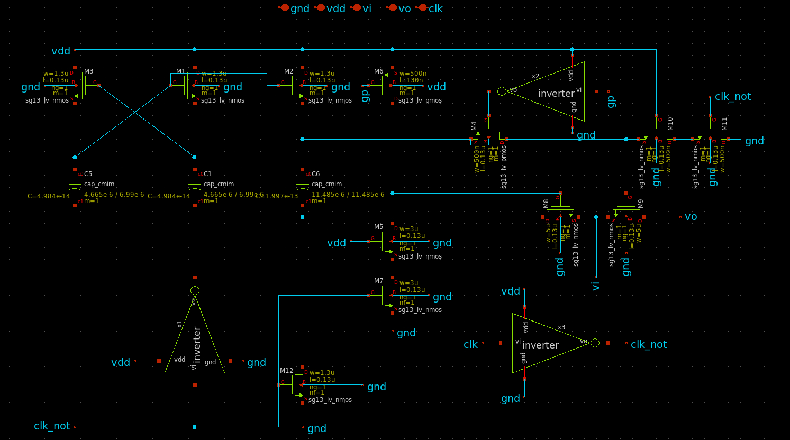
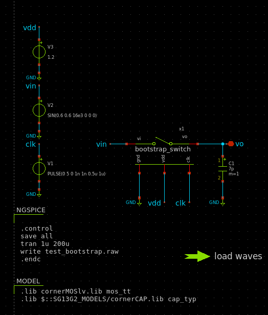
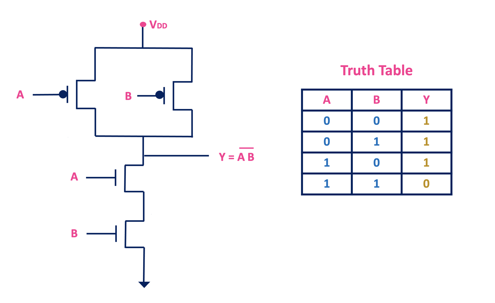
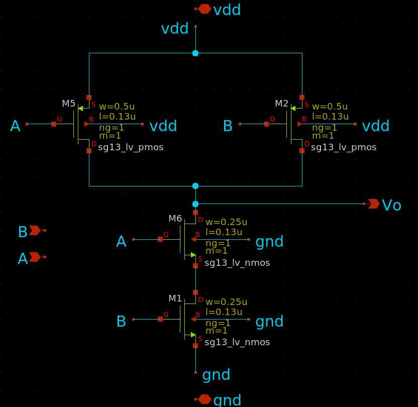
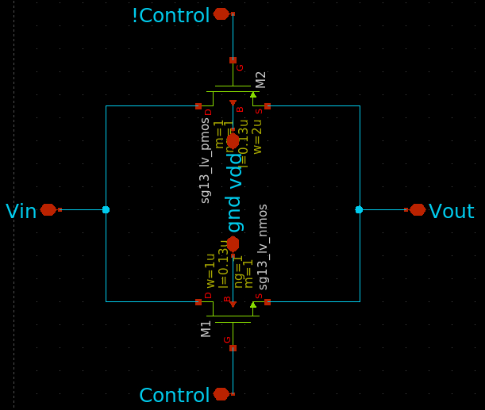

# Digital Components

In this section, we will implement several essential digital components required for the SAR ADC. These include:

- **SAR Algorithm**: The control logic responsible for managing the successive approximation process during analog-to-digital conversion.
    
- **Bootstrap Switch**: Used for sampling the input voltage onto the C-DAC with minimal distortion and high linearity.
    
- **Transmission Gate**: Employed to switch the bottom plates of the capacitors in the C-DAC.
    
- **NAND Gate**: Utilized to generate control signals such as the SAR clock.
    

We will begin by focusing on the **SAR algorithm** and integrating it into Xschem for performing mixed-signal simulations. This integration can be complex, but the provided module offers a working setup to help you get started. In the following, we will break down this setup and its file structure.
## Understanding the File Structure

Navigate to the following folder:

```
module_3_8_bit_SAR_ADC/part_2_digital_comps
```
Inside the `algorithm` directory, you will find all necessary files for simulating and compiling the SAR algorithm. Let’s start by reviewing the Verilog code for the SAR logic:
```
module sar_logic (
    input wire clk, 
    input wire Op,
    input wire En,
    input wire Om,
    input wire rst,
    output reg [6:0] B,   // 7-bit
    output reg [6:0] BN,  // 7-bit
    output reg [7:0] D    // 8-bit
);

reg [3:0] counter = 4'b0000; // 4-bit counter

always @(posedge clk) begin
    if (rst) begin
        B <= 7'b0000000;
        BN <= 7'b0000000;
        D <= 8'b00000000;
        counter <= 4'b0000;
    end else if (En && (Op ^ Om)) begin
        if (counter < 7) begin 
            D <= D | ({7'b0, Op} << counter);
              
            B[counter % 7] <= (Op) ? 1'b1 : 1'b0;
            BN[counter % 7] <= (Om) ? 1'b1 : 1'b0;

            counter <= counter + 1'b1;
        end
    end
end

endmodule

```
### Code Explanation

This Verilog module describes a simple synchronous SAR algorithm that operates on the **positive edge of the clock**. The two comparator outputs, `Op` and `Om`, represent complementary decision signals at each iteration.

- `Op` is high if the input is greater than the DAC value.
    
- `Om` is high if the input is less than the DAC value.
    
- The output `D` stores the 8-bit final result of the SAR conversion.
    
- `B` and `BN` store intermediate bits of the decision logic in direct and inverted form, respectively.
    
- A 4-bit `counter` tracks the current bit being decided.
    
- The logic ensures only one bit decision is taken per clock cycle.

The next Verilog related file you will see is a simple testbench for the Verilog code which will not be shown here since this can easily be modified.

## Supporting Files

### `conf.gtkw` – GTKWave Configuration

This file configures the GTKWave waveform viewer to automatically load the relevant signals and layout. It includes the following lines:

```

[*]
[*] GTKWave Analyzer v3.3.116 (w)1999-2023 BSI
[*] Mon Sep 30 13:11:15 2024
[*]
[dumpfile] "sar_logic_tb.vcd"
[dumpfile_mtime] "Mon Sep 30 13:10:47 2024"
[dumpfile_size] 777
[savefile] "conf.gtkw"
[timestart] 0
[size] 1906 985
[pos] -1 -1
*-14.000000 -1 -1 -1 -1 -1 -1 -1 -1 -1 -1 -1 -1 -1 -1 -1 -1 -1 -1 -1 -1 -1 -1 -1 -1 -1 -1 -1
[sst_width] 269
[signals_width] 102
[sst_expanded] 1
[sst_vpaned_height] 291
@28
sar_logic_tb.Op
sar_logic_tb.Om
sar_logic_tb.B[6:0]
sar_logic_tb.BN[6:0]
sar_logic_tb.D[7:0]
sar_logic_tb.clk
sar_logic_tb.rst
sar_logic_tb.En
@29
[pattern_trace] 1
[pattern_trace] 0

```
This ensures that all key signals are pre-loaded when you open GTKWave, allowing you to quickly inspect the SAR algorithm’s behavior.

### `Makefile` – Automation and Simulation

The `Makefile` provides automation for compiling, simulating, viewing waveforms, and generating mixed-signal compatible modules. Here's a breakdown of its targets:

```

# Define variables
IVERILOG = iverilog
VVP = vvp
GTKWAVE = gtkwave
NGSPICE = ngspice
OUTPUT = sar_logic.out
MIXED = sar_logic.so
MIXED_OBJ = sar_logic_obj_dir
VCD_FILE = sar_logic_tb.vcd
SRC_FILES = sar_logic.v sar_logic_tb.v
NGSPICE_FILE = sar_logic.v
DEST_DIR = ../xschem/simulations
# Default target
all: run_wave

# Compile using iverilog
$(OUTPUT): $(SRC_FILES)
	$(IVERILOG) -o $(OUTPUT) $(SRC_FILES)

# Run the simulation with vvp
run: $(OUTPUT)
	$(VVP) $(OUTPUT)

copy: 
	cp $(MIXED) $(DEST_DIR)

# Open the wave file in GTKWave
wave: $(VCD_FILE)
	$(GTKWAVE) $(VCD_FILE) conf.gtkw

# Run ngspice vlnggen command
ngspice:
	$(NGSPICE) vlnggen $(NGSPICE_FILE)

# Execute both the simulation and wave viewer
run_wave: run wave

# Run ngspice and then the rest of the steps
full: ngspice run_wave copy

# Clean up generated files
clean:
	rm -f $(OUTPUT) $(VCD_FILE) $(MIXED)
	rm -rf $(MIXED_OBJ) 
```
in the defined variables you can follow the same structure for any given code, the most essential is the dump files, shared object file used for simulation (**.so**) and ofcourse the src_files.
#### Targets:

- `all` → Runs the full simulation and waveform view (`run_wave`).
    
- `$(OUTPUT)` → Compiles the Verilog files using Icarus Verilog.
    
- `run` → Executes the compiled simulation, generating a `.vcd` file.
    
- `wave` → Opens the `.vcd` waveform in GTKWave with the saved config.
    
- `run_wave` → Combines both `run` and `wave`.
    
- `ngspice` → Generates the `.so` file for use in mixed-signal simulations with Xschem/Ngspice using `vlnggen`.
    
- `copy` → Copies the `.so` file to the appropriate Xschem simulation folder.
    
- `full` → Executes all steps: create `.so`, simulate, view, and copy.
    
- `clean` → Cleans all generated files including `.out`, `.vcd`, `.so`, and intermediate directories.

```
make run_wave   # Compile and open wave viewer
make full       # Full build including mixed-signal export and copy
make clean      # Clean up simulation artifacts
```

Now at this point you can write *make full*. And this should compile the Verilog code and give you the following view:
<p align="center"> 
   
</p>


From here, you can modify the testbench to observe different behaviors or expand the `sar_logic_tb` hierarchy in GTKWave to explore the available signal waveforms.


## Creating the Symbol for Mixed-Signal Simulation

The next step is to create a symbol for use in mixed-signal simulations with Xschem. This process can be particularly tricky, as it requires correct syntax and precise ordering of pins. To simplify this, a Python script has been provided specifically for generating a symbol for `sar_logic.v`.

> ⚠️ Note: This script is tailored to the `sar_logic.v` module and may not work for other designs without modification.

### Running the Symbol Generation Script

Navigate to the Python folder located at:
```
part_2_digital_comps/algorithm/python
```
The script is invoked as follows:

```
Usage: python generate_sym.py <verilog_file> <symbol_file>
Example: python generate_sym.py control.v test.sym

```
For our case, run:

```
python3 generate_sym.py ../verilog/sar_logic.v ../xschem/sar_logic.sym

```

You should see output similar to:

```
Parsed module: sar_logic
Inputs: ['clk', 'Op', 'En', 'Om', 'rst']
Outputs: ['D7', 'D6', 'D5', 'D4', 'D3', 'D2', 'D1', 'D0', 'BN6', 'BN5', 'BN4', 'BN3', 'BN2', 'BN1', 'BN0', 'B6', 'B5', 'B4', 'B3', 'B2', 'B1', 'B0']
Xschem symbol written to ../xschem/sar_logic.sym

```
You can now navigate to the `xschem` folder and view the newly generated symbol:
<p align="center"> 
   
</p>

> ⚠️ Note: In the make file the location for the shared object file `(.so)` was specified as in the simulations folder generated by xschem, this is needed for the mixed signal simulation.

## Preparing the Mixed-Signal Testbench

Inside the same `xschem` directory, you will also find two additional symbols:

- `adc_bridge1.sym`: Converts analog input into digital signals compatible with the SAR logic.
    
- `dac_bridge1.sym`: Converts digital output from the SAR logic into analog signals for NGSpice.
    

These bridges are essential for enabling mixed-signal simulation in NGSpice.

With everything set up, you can now build a testbench using the generated `sar_logic.sym` and the two bridge components:
<p align="center"> 
   
</p>


## Stimuli and Simulation Setup

The following PULSE sources are used to simulate signal transitions:

- **Op**:
```
name=V6 value="dc 0 ac 0 PULSE(1.2 0 100u 1n 1n 500u 1m)"
```
- **Om**:
```
"dc 0 ac 0 PULSE(0 1.2 100u 1n 1n 500u 1m)"
```
- **En**:
```
"dc 0 ac 0 PULSE(1.2 0 0 1n 1n 30u 1m)"
```
- **clk**:```
"dc 0 ac 0 PULSE(0 1.2 0 10p 10p 5u 10u)"

- **rst**:
```
"dc 0 ac 0 PULSE(0 1.2 100u 1n 1n 10u 1m)"
```
For simulation, a transient analysis is defined:

```
name=NGSPICE only_toplevel=true 
value="
.param temp=27
.control
save all 
tran 1u 200u
write sar_logic.raw
.endc
"
```
Once everything is in place, you can run the simulation. The waveform output should resemble the one below:
<p align="center"> 
   
</p>

## What's Next?

You are encouraged to experiment with the input signals, change timings, and verify the results against the standalone Verilog testbench. This is a great way to gain intuition about how the SAR logic behaves in a mixed-signal context.


## Bootstrap - Switch

Explain the function of bootstrap switch

In this design the bootstrap switch that was used is a modification of the one seen below:
<p align="center"> 
   
</p>

the schematic for the boostrap can be seen in the following image
<p align="center"> 
   
</p>

The dimensions of the transistors and caps are in reference to the schematic in xschem.

**NMOS Transistors (`sg13_lv_nmos`):**
- M1: W = 1.3 µm, L = 0.13 µm, ng = 1, m = 1
- M2: W = 1.3 µm, L = 0.13 µm, ng = 1, m = 1
- M3: W = 1.3 µm, L = 0.13 µm, ng = 1, m = 1
- M5: W = 3.0 µm, L = 0.13 µm, ng = 1, m = 1
- M7: W = 3.0 µm, L = 0.13 µm, ng = 1, m = 1
- M8: W = 5.0 µm, L = 0.13 µm, ng = 1, m = 1
- M9: W = 5.0 µm, L = 0.13 µm, ng = 1, m = 1
- M10: W = 0.5 µm, L = 0.13 µm, ng = 1, m = 1
- M11: W = 0.5 µm, L = 0.13 µm, ng = 1, m = 1
- M12: W = 1.3 µm, L = 0.13 µm, ng = 1, m = 1
    
**PMOS Transistors (`sg13_lv_pmos`):**
- M4: W = 0.5 µm, L = 0.13 µm, ng = 1, m = 1
- M6: W = 0.5 µm, L = 0.13 µm, ng = 1, m = 1

**Capacitors (`cap_cmim`):**
- C1:  W = 4.665 µm L = 6.99 µm  m = 1
- C5:  W = 4.665 µm L = 6.99 µm  m = 1
- C6:  W = 11.485 µm L = 11.485 µm m = 1


 For the inverter the reader is needed to design this use the following parameters
**NMOS Transistors (`sg13_lv_nmos`):**
- M1: W = 1.3 µm, L = 0.4 µm, ng = 1, m = 1

**PMOS Transistors (`sg13_lv_pmos`):**
- M2: W = 1.3 µm, L = 0.8 µm, ng = 1, m = 1

From here the symbol can be made. It was done in the following way:
<p align="center"> 
   
</p>

## Testing the Bootstrap Switch

The next step is to evaluate the **transient behavior** of the bootstrap switch. For this purpose, the following testbench was created:
<p align="center"> 
   
</p>

A simple transient analysis was performed with the following input stimuli:

- **Clock (clk):**
```
name=V1 value="PULSE(0 5 0 1n 1n 0.5u 1u)"
```
- **Input Voltage (vin):**
```
name=V2 value="SIN(0.6 0.6 16e3 0 0 0)"

```
According to the documentation, the syntax for a sinusoidal source is:

```
SIN(VO VA FREQ TD THETA PHASE)
```
In this case, the input is a very low-frequency signal, which is acceptable for now. The rest of the testbench is fairly self-explanatory, so we proceed directly to the simulation. The resulting output is shown below:
<p align="center"> 
   
</p>

An interesting next step would be to evaluate **SNR, SINAD, and ENOB** based on the simulation output. To extract the necessary waveform data, you can use the following script within the code block:

```
name=NGSPICE
only_toplevel=true
value="
.control
save all
tran 1u 200u
set wr_singlescale
set wr_vecnames
write test_bootstrap.raw
wrdata vout_data.txt v(vo)
.endc
" 
```

## Logic Gates

For generating the clock required by the SAR algorithm and applying logic to the C-DAC, we need basic **logic gates** such as NAND and transmission gates.

### NAND Gate

The schematic of a CMOS NAND gate is straightforward and is shown below:
<p align="center"> 
   
</p>

[Image Source](https://www.allaboutelectronics.org/cmos-logic-gates-explained/)

The corresponding Xschem implementation:
<p align="center"> 
   
</p>

Transistor sizing used:

**NMOS Transistors (`sg13_lv_nmos`):**

- M: W = 0.25 µm L = 0.13 µm ng = 1 m = 1
    

**PMOS Transistors (`sg13_lv_pmos`):**

- M2: W = 0.5 µm L = 0.13 µm ng = 1 m = 1
    

The corresponding symbol:
<p align="center"> 
   
</p>


You can find the testbench under:

```
part_2_digital_comps/nand_gate/testbench

```
At this point in the module, the testbench setup should be fairly straightforward to follow.

## Transmission Gate

The **transmission gate** is a critical component in this design, as it delivers digital logic signals to the C-DAC. Its schematic is shown here:
<p align="center"> 
   
</p>

The Xschem implementation:
<p align="center"> 
   
</p>

Transistor sizing:

**NMOS Transistors (`sg13_lv_nmos`):**

- M: W = 1.0 µm L = 0.13 µm ng = 1 m = 1
    

**PMOS Transistors (`sg13_lv_pmos`):**

- M2: W = 2.0 µm L = 0.13 µm ng = 1 m = 1
    

Corresponding symbol:
<p align="center"> 
   
</p>

### Testbench for Transmission Gate as Switch

To test the transmission gate in a switching configuration, the following testbench was created:

<p align="center"> 
   
</p>

Here, the transmission gate passes either **Vref/Vdd** or **GND**, depending on the control signal. The testbench schematic:
<p align="center"> 
   
</p>

- **Vdd** is set to 1.2 V
    
- **Vref** is 0.6 V (arbitrarily chosen)
    

The control pulse is defined as:
```
name=V2 value="PULSE(0 1.2 0 1u 1u 10u 20u)"
```
After simulation, the results should resemble the following:
<p align="center"> 
   
</p>

As observed, when the control signal is high, the output is grounded; when low, it passes Vref.
