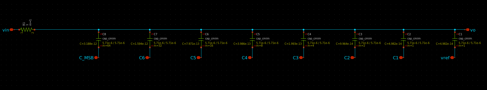

# Array Components

In this section, we won't focus on heavy simulation but instead use this step as an intermediate phase to simplify our final schematic for the SAR ADC. Here, we'll create the C-DAC, which is essentially an array of capacitors, and the "switch bank," which consists of transmission gates that control the logic level applied to the capacitors.

## C-DAC (Capacitive DAC)

The first component we'll create is the Capacitive DAC (C-DAC). This is a simple array of capacitors, and the design in Xschem looks like this:

 
   

The C-DAC is formed by placing 8 capacitors in parallel, with the following dimensions:

**Capacitor Dimensions (cap_cmim):**

- **C1** between `vo` and `vref`: W = 5.71 µm, L = 5.71 µm, m = 1
    
- **C2** between `vo` and `C1`: W = 5.71 µm, L = 5.71 µm, m = 1
    
- **C3** between `vo` and `C2`: W = 5.71 µm, L = 5.71 µm, m = 2
    
- **C4** between `vo` and `C3`: W = 5.71 µm, L = 5.71 µm, m = 4
    
- **C5** between `vo` and `C4`: W = 5.71 µm, L = 5.71 µm, m = 8
    
- **C6** between `vo` and `C5`: W = 5.71 µm, L = 5.71 µm, m = 16
    
- **C7** between `vo` and `C6`: W = 5.71 µm, L = 5.71 µm, m = 32
    
- **C_MSB** between `vo` and `C_MSB`: W = 5.71 µm, L = 5.71 µm, m = 64
    

Additionally, you will notice that an extra resistor is placed between the input and output. Without this resistor, the input and output would be shorted, so we place an abstract resistor with a negligible size in series to prevent this issue.

The symbol for the C-DAC can be seen below:

 
   

## Switch Bank

Next, we will create the "switch bank." This block contains all the switches that control the bottom plates of the C-DAC capacitors. The schematic for the switch bank is simple and closely follows the structure we used earlier in this module's testbench:

The naming convention for the I/Os is as follows:

- D_MSB -> S_MSB
    
- D6 -> S6
    
- D5 -> S5
    
- D4 -> S4
    
- D3 -> S3
    
- D2 -> S2
    
- D1 -> S1
    

Where the D's are digital inputs from the algorithm, and the S's correspond to the logic levels for the capacitors' bottom plates.

The symbol for this switch bank is shown below:

 
   

**TIP:**

> To ensure a neat layout, import the symbol for the C-DAC and match the dimensions of the switch bank. This will make sure everything aligns well in the final schematic.
