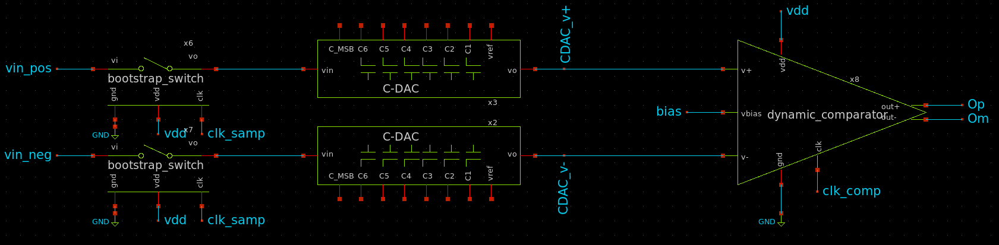

# SAR ADC

In this section, we’ll dive into creating the final schematic for the SAR ADC. Since the design involves many components, the final testbench will be quite large, which means the transient simulation—our primary focus—will naturally be substantial. A good approach to building such a large design is to insert and verify each component one at a time. Although we will move quickly through the steps, it’s crucial for the reader to work through each stage carefully to ensure everything functions as intended.

## Importing the SAR Algorithm

Before diving into the full ADC schematic, it's essential to check whether the SAR algorithm can be simulated in the testbench. This can be done by copying the schematic from earlier in the module that uses mixed-signal simulation. You can then use this as the starting point for the rest of the schematic.

> ⚠️ **Note:** Make sure to copy the shared object file (`.so`) and place it relative to the testbench, just like we did before. Create a simulation folder and include it there:


├── SAR_ADC_tb.sch

├── simulations

│   └── sar_logic.so

└── xschemrc

In this example, the wiring looks like this:
<p align="center"> 
   
</p>


Notice that the output numbering is reversed for B and BN because the first bit (i.e., B0 or BN0) will be flipped to represent the MSB. It’s recommended to apply some test signals to this block to ensure that it compiles and runs correctly.

### S/H, Comparator, and C-DAC

Next, we import the bootstrap switch, comparator, and C-DAC, which will form the core of the ADC. These components are implemented as follows:
<p align="center"> 
   
</p>

The labeling can be done in any way that suits your design preferences.

## Switch Bank

Now, we connect the switch bank to the C-DAC and label it according to the outputs from the SAR algorithm. The wiring setup is shown below:
<p align="center"> 
   
</p>

## Defining Signals and Biasing

At this stage, we need to define the biasing and signals used in the system. Below are the configurations for various components:

1. **Comparator Bias (bias):**
```
value=0.6
```

2. **Sampling Clock (clk_samp):**
```
"dc 0 ac 0 PULSE(0 1.2 0 10p 10p T_half T)"
```

3. **Vdd (Vdd):**
```
value=1.2
```

4. **Comparator Clock (clk_comp):**
```
"dc 0 ac 0 PULSE(0 1.2 comparator_delay 10p 10p T_algo_PW T_algo)"
```

5. **Positive Input to ADC (vin_pos):**
```
value=0.8
```

6. **Negative Input to ADC (vin_neg):**
```
value=0.4
```

7. **Clock for Postprocessing (dac_clk):**
```
"dc 0 ac 0 PULSE(0 1.2 DAC_delay 10p 10p DAC_PW T)"
```


These signals are configured as shown below:
<p align="center"> 
   
</p>

To generate the clock for the algorithm, we use a NAND gate connected to the output of the comparator. This creates a "valid" signal when one output is high and the other is low. The connection is as follows:
<p align="center"> 
   
</p>

## Code Blocks

Now we’re ready to define the simulation code blocks. As always, we start by creating the code block for the models:

```
name=MODEL only_toplevel=true
format="tcleval( @value )"
value=".lib cornerMOSlv.lib mos_tt
.lib $::SG13G2_MODELS/cornerCAP.lib cap_typ
"
```
Next, we define the simulation code block by setting the simulation parameters and running the transient analysis:

```
name=NGSPICE only_toplevel=true 
value="
.param temp=27
.param T = 1u
.param T_half = T/2
.param T_algo = T/16
.param T_algo_delay = T/10
.param T_algo_PW = T/32
.param DAC_delay = 0.99*T
.param DAC_PW = T/20
.param comparator_delay = 0.328*T

.control
tran 1u 8u 
let vin_diff = v(Vin_pos) - v(Vin_neg)
let comp_diff = v(op)- v(om)
write sar_adc_test.raw
.endc
"

```
### Code Explanation:

1. **Simulation Parameters:**
    
    - `.param temp=27` sets the temperature to 27°C.
        
    - `.param T = 1u` defines the base time period `T` as 1 µs.
        
    - `.param T_half = T/2` defines half of `T`.
        
    - `.param T_algo = T/16` is the time period for the algorithm (16 times smaller than `T`).
        
    - `.param T_algo_delay = T/10` sets the delay for the algorithm to 1/10 of `T`.
        
    - `.param T_algo_PW = T/32` defines the pulse width of the algorithm clock.
        
    - `.param DAC_delay = 0.99*T` defines the DAC delay as 99% of `T`.
        
    - `.param DAC_PW = T/20` defines the DAC pulse width.
        
    - `.param comparator_delay = 0.328*T` defines the comparator delay.
        
2. **Simulation Control:**
    
    - `.control` starts the simulation block.
        
    - `tran 1u 8u` specifies a transient analysis with a step size of 1 µs and a total simulation time of 8 µs.
        
    - `let vin_diff = v(Vin_pos) - v(Vin_neg)` computes the differential voltage between the positive and negative inputs to the ADC.
        
    - `let comp_diff = v(op) - v(om)` computes the difference between the output of the comparator.
    
	- **write sar_adc_test.raw** saves the data in binary format under simulation so it can be used for plotting the data in Xschem

    
3. **End of Simulation:**
    
    - `.endc` marks the end of the control block, completing the simulation setup.


## Running the Simulation

Below, the clock waveforms are shown. As seen, the sampling phase ends when `clk_samp` goes low, which then triggers the comparator. This firing of the comparator generates a rising edge on `clk_algo`, initiating the SAR conversion. Since the `reset (rst)` signal is connected to the sampling clock and `Enable (En)` is tied to `Vdd` (i.e., always logic high), the SAR logic responds to the `clk_algo` signal (the output of the NAND gate) and begins the bit-wise comparison process.

> **Note:** The comparator performs comparisons on the **falling edge**, not the rising edge.

After the 8th comparison (i.e., once all bits are resolved), the `DAC_clk` signal is triggered. This clock is later used in post-processing when an ideal DAC is implemented in Python.
<p align="center"> 
   
</p>

<p align="center"> 
   
</p>

Looking at the voltage across the C-DAC during the conversion phase, we observe the following waveform:
<p align="center"> 
   
</p>

This confirms that the SAR conversion is functioning correctly.

---

## Further Analysis

At this point, we have a working SAR ADC, so the primary tutorial goal is achieved. However, we will now extend the analysis by extracting the output and post-processing it in Python to recover the ADC's differential input waveform.

To do this, we’ll apply a differential sinusoidal input and make minor modifications to our simulation setup.

### Modified Input Sources

We apply two sinusoidal sources 180° out of phase:

1. **Positive Input to ADC (`vin_pos`):**
```
"dc 0 ac 0 SIN(0.6 0.3 12.7k 0 0 0)"
```

**Negative Input to ADC (`vin_neg`):**
```
"dc 0 ac 0 SIN(0.6 0.3 12.7k 0 0 180)"
```
With this configuration, we expect the differential input to be a sinusoidal waveform of 12.7 kHz.

### Updated NGspice Simulation Block

We'll also update the transient simulation command to run longer and collect more samples. Additionally, to avoid creating an extremely large binary waveform file (which could exceed 20 GB), we'll directly export selected signals to a text file for external processing:


```
"
.param temp=27
.param T = 1u
.param T_half = T/2
.param T_algo = T/16
.param T_algo_delay = T/10
.param T_algo_PW = T/32
.param DAC_delay = 0.99*T
.param DAC_PW = T/20
.param comparator_delay = 0.328*T

.control
tran 1u 320u 
let vin_diff = v(Vin_pos) - v(Vin_neg)
let comp_diff = v(op)- v(om)
set wr_singlescale
set wr_vecnames
wrdata bit_data.txt D0 D1 D2 D3 D4 D5 D6 D7 vin_diff dac_clk
.endc
"
```
The lines:
```

set wr_singlescale
set wr_vecnames
wrdata bit_data.txt D0 D1 D2 D3 D4 D5 D6 D7 vin_diff dac_clk
```

The extracted data comes directly from the SAR logic and includes:

- The 8 output bits (`D0`–`D7`)
    
- The differential input voltage (`vin_diff`)
    
- The DAC clock signal (`dac_clk`), which serves as a virtual clock for reconstructing the analog output using an ideal DAC in Python.
    

These signals are saved into a text file during the simulation and can be post-processed externally. In the directory:

```
module_3_8_bit_SAR_ADC/part_4_SAR_ADC/scripting
```
you will find a Jupyter Notebook that loads this data and reconstructs the analog signal using a Python function called `virtual_dac`.
### Example Dataframe from JupyterLab

When the `bit_data.txt` is imported, the dataframe looks as follows:
<p align="center"> 
   
</p>

### The `virtual_dac()` Function

Here is the key function used to reconstruct the analog signal from the digital SAR output:

```
def virtual_dac(df, vmin=-1.2, vmax=1.2, vdd=1.2, vss=0.0,
                          thresh=None, dir=1, td=0, tt=0):
    if thresh is None:
        thresh = (vdd + vss) / 2.0

    # Verilog-A bit order: i1 (LSB) to i8 (MSB)
    bits = ['D0', 'D1', 'D2', 'D3', 'D4', 'D5', 'D6', 'D0']  # D0 is MSB in your DF
    fullscale = vmax - vmin

    clk = df['dac_clk'].values
    time = df['time'].values
    output = np.zeros(len(df))
    prev_clk = clk[0]
    aout = 0

    for i in range(len(df)):
        clk_edge = False
        if dir == 1 and prev_clk <= thresh and clk[i] > thresh:
            clk_edge = True  # Rising edge
        elif dir == -1 and prev_clk >= thresh and clk[i] < thresh:
            clk_edge = True  # Falling edge

        if clk_edge or i == 0:  # i == 0 handles initial_step
            aout = 0
            weight = 2
            for bit in bits:
                if df[bit].iloc[i] > thresh:
                    aout += fullscale / weight
                weight *= 2
            output[i] = aout + vmin
        else:
            output[i] = output[i - 1]  # Hold previous value

        prev_clk = clk[i]

    return output
```

### Parameters

- `vmin` and `vmax`: Define the full differential range of the DAC.
    
- `vdd` and `vss`: Define the power supply range.
    
- `thresh`: Optional threshold; defaults to `(vdd + vss) / 2`.
    
- `dir`: Clock edge direction (1 for rising, -1 for falling).
    
### Results

If the Ngspice simulation was successful, the `vin_diff` plot should look like:
<p align="center"> 
   
</p>

And the reconstructed output from the ideal DAC will appear as:
<p align="center"> 
   
</p>

## Conclusion

This post-processing step demonstrates how to extract and visualize the SAR ADC output. The setup also forms a solid foundation for further analysis, such as computing dynamic performance metrics of the ADC—SNR, SINAD, and ENOB—using standard Python libraries.
